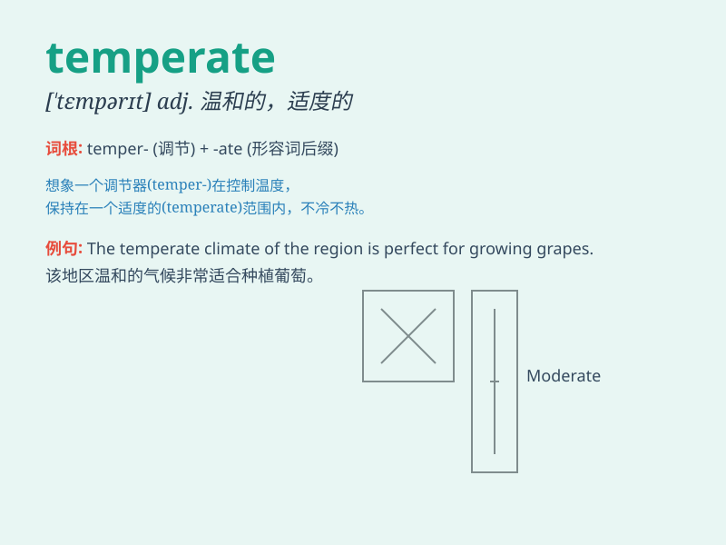

## temperate

**英音:** _[\'temp(ə)rət]_ **美音:** _[ˈtɛmpərɪt;
temˈpərit]_

**译义:** *adj.有节制的,适度的,戒酒的,(气候)温和的*

### 短语

+ **temperate zone:** _温带_

+ **temperate climate:** _温和的气候；温带气候_

+ **temperate grassland:** _温带草原_

+ **temperate rainforest:** _温带雨林_

+ **temperate region:** _温带地区_

### 例句

#### 例句1

> **The climate in this region is temperate, with mild winters and
warm summers.**

**中文翻译:** 该地区气候温和，冬季温和，夏季温暖。

**单词释义:** 温和的；温带的

#### 例句2

> **He has a temperate personality and never gets angry easily.**

**中文翻译:** 他性格温和，从不轻易发怒。

**单词释义:** 温和的；平和的

#### 例句3

> **We should adopt temperate measures to solve the problem.**

**中文翻译:** 我们应该采取温和的措施来解决问题。

**单词释义:** 适度的；有节制的

### 背诵小故事

> A traveler was lost in a strange land. The weather was temperate,
neither too hot nor too cold. It made the journey pleasant. The traveler
remembered \'temperate\' as the perfect climate for a comfortable
adventure.

**一位旅行者在陌生的地方迷路了。天气温和，既不太热也不太冷。这让旅程很愉快。旅行者记住'temperate'就是这种舒适冒险的完美气候。**

### 图义

