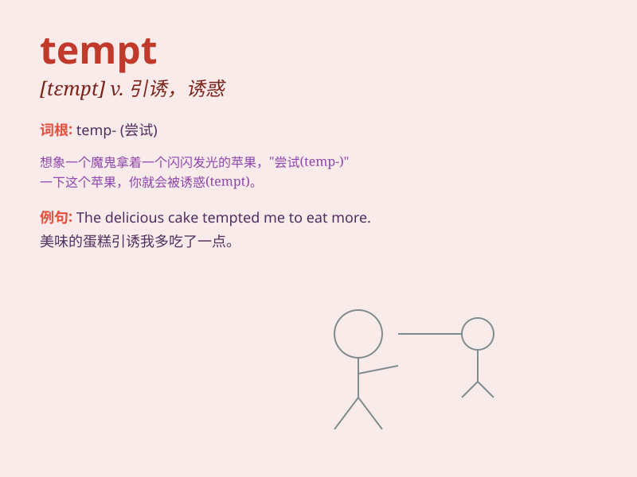

## tempt

**英音:** _[tem(p)t]_ **美音:** _[tɛmpt]_

**译义:** *vt.诱惑,引诱,吸引,使感兴趣,考验,试探*

### 短语

+ **tempt fate:** _冒险；玩命_

+ **tempt someone into doing something:** _引诱某人做某事_

+ **tempt providence:** _玩命；冒险；鲁莽行事_

+ **be tempted to do something:** _很想做某事；受诱惑做某事_

+ **tempt the fates:** _冒险；碰运气_

### 例句

#### 例句1

> **The smell of fresh cookies tempted me to go into the bakery.**

**中文翻译:** 新鲜饼干的香味吸引着我走进面包店。

**单词释义:** 诱惑，吸引

#### 例句2

> **Don\'t be tempted to cheat in the exam.**

**中文翻译:** 不要试图在考试中作弊。

**单词释义:** 引诱，怂恿

#### 例句3

> **The offer of a high salary tempted him to leave his current
job.**

**中文翻译:** 高薪诱惑他辞去目前的工作。

**单词释义:** 吸引，使感兴趣

### 背诵小故事

> A poor boy was very hungry. A rich man showed him a big cake to tempt
him. But the boy resisted, knowing it was wrong to take without earning.
Remember, \'tempt\' means to attract or persuade someone to do
something, especially something wrong or unwise.

**一个贫穷的男孩非常饥饿。一个富人给他展示了一个大蛋糕来诱惑他。但男孩抵制住了，知道不劳而获是不对的。记住，'tempt'意思是吸引或劝说某人做某事，尤指错误或不明智的事。**

### 图义

