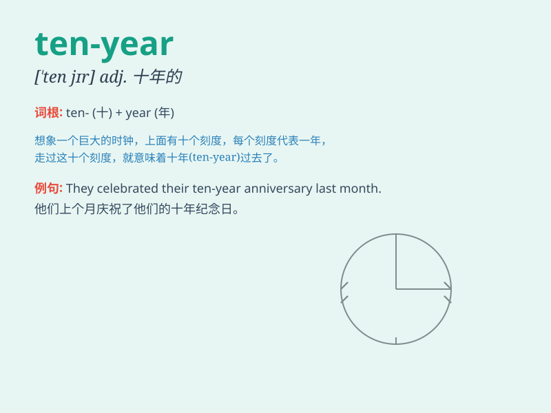

## ten-year

**英音:** __ **美音:** __

**译义:** *十年的；十岁的*

### 短语

+ **ten-year-old:** _十岁的_

+ **ten-year plan:** _十年计划_

+ **ten-year anniversary:** _十周年纪念日_

+ **ten-year guarantee:** _十年质保_

+ **ten-year cycle:** _十年周期_

### 例句

#### 例句1

> **The ten-year-old boy is very smart.**

**中文翻译:** 这个十岁的男孩非常聪明。

**单词释义:** 十岁的

#### 例句2

> **She signed a ten-year contract with the company.**

**中文翻译:** 她和这家公司签了一份十年的合同。

**单词释义:** 十年的

#### 例句3

> **They have been married for a ten-year period.**

**中文翻译:** 他们已经结婚十年了。

**单词释义:** 十年的

### 背诵小故事

> A ten-year-old boy named Tom was very brave. One day, he decided to
take a ten-year journey to explore the world. After ten years, he
returned home with wonderful memories.

**一个叫汤姆的十岁男孩非常勇敢。有一天，他决定进行为期十年的旅程去探索世界。十年后，他带着美好的回忆回家了。**

### 图义

