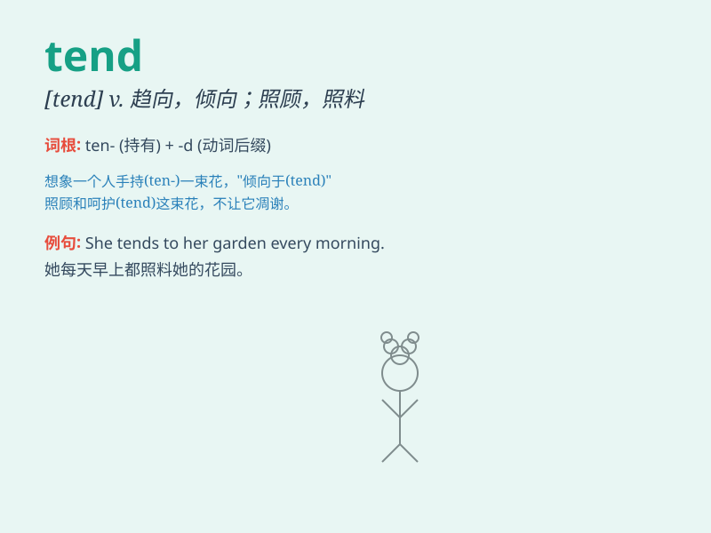

## tend

**英音:** _[tend]_ **美音:** _[tɛnd]_

**译义:** *vi.趋向,往往是vt.照管,护理*

### 短语

+ **tend to:** _倾向于；常常；易于_

+ **tend on:** _招待；照料_

+ **tend towards:** _趋向；走向；倾向_

+ **tend out:** _照料；照管_

+ **tend for:** _照管；护理_

### 例句

#### 例句1

> **She tends to get angry when she\'s under stress.**

**中文翻译:** 当她有压力时，她往往会生气。

**单词释义:** 往往会，常常会

#### 例句2

> **Farmers tend their fields carefully to ensure a good harvest.**

**中文翻译:** 农民们精心照料田地，以确保丰收。

**单词释义:** 照料，照管

#### 例句3

> **Prices tend to rise during the holiday season.**

**中文翻译:** 假期期间价格往往会上涨。

**单词释义:** 倾向于，趋于

### 背诵小故事

> One day, I was in a beautiful garden. A gardener was tending the
flowers carefully. He was always inclined to make the garden perfect.
So, \'tend\' means to take care of or be inclined to.

**有一天，我在一个美丽的花园里。一位园丁正在精心照料花朵。他总是倾向于把花园弄得完美。所以，'tend'意思是照料或倾向于。**

### 图义

