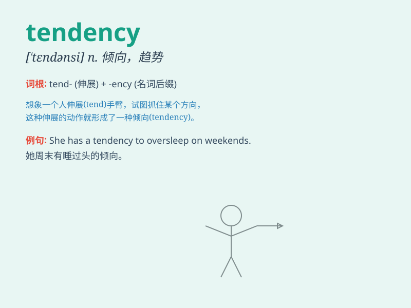

## tendency

**英音:** _[\'tend(ə)nsɪ]_ **美音:** _[\'tɛndənsi]_

**译义:** *n.趋向,倾向*

### 短语

+ **tendency to do sth:** _做某事的倾向_

+ **have a tendency:** _有倾向；有趋势_

+ **growth tendency:** _增长趋势_

+ **downward tendency:** _下降趋势_

+ **upward tendency:** _上升趋势_

### 例句

#### 例句1

> **She has a tendency to be late for meetings.**

**中文翻译:** 她开会有迟到的倾向。

**单词释义:** 倾向；趋势

#### 例句2

> **There is a growing tendency towards online shopping.**

**中文翻译:** 网上购物的趋势日益增长。

**单词释义:** 趋势

#### 例句3

> **His tendency to overeat is causing health problems.**

**中文翻译:** 他暴饮暴食的倾向导致了健康问题。

**单词释义:** 倾向

### 背诵小故事

> Once upon a time, there was a scientist who observed a group of
animals. He noticed a tendency for them to gather near the river at
sunset. This regular behavior pattern was called a tendency.

**从前，有一位科学家观察一群动物。他注意到它们有在日落时靠近河边的倾向。这种规律性的行为模式就被称为倾向。**

### 图义

