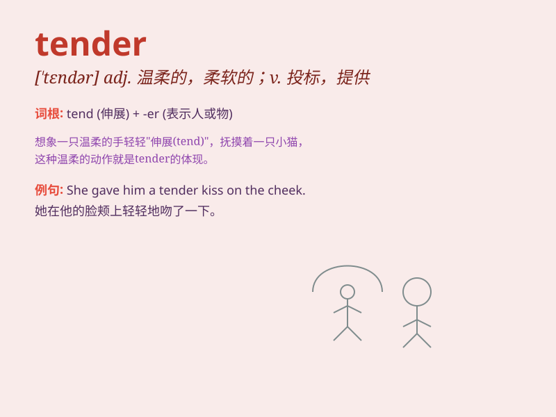

## tender

**英音:** _[\'tendə]_ **美音:** _[\'tɛndɚ]_

**译义:** *adj.嫩的,温柔的,软弱的*

### 短语

+ **tender love:** _温柔的爱_

+ **tender offer:** _投标报价；善意收购_

+ **tender heart:** _善良的心；柔软的心_

+ **tender age:** _幼年；年幼_

+ **tender mercy:** _仁慈；宽厚_

### 例句

#### 例句1

> **The meat was so tender that it melted in my mouth.**

**中文翻译:** 肉很嫩，在我嘴里融化了。

**单词释义:** 嫩的；柔软的

#### 例句2

> **She made a tender offer to help him.**

**中文翻译:** 她主动提出要帮助他。

**单词释义:** 温柔的；亲切的

#### 例句3

> **The company submitted a tender for the construction project.**

**中文翻译:** 该公司对该建设项目进行了招标。

**单词释义:** 投标

### 背诵小故事

> A little girl was very tender. She carefully took care of a wounded
bird, showing her gentle and kind heart. The bird felt safe in her
tender care.

**一个小女孩非常温柔。她小心翼翼地照顾一只受伤的鸟，展现出她温柔善良的心。这只鸟在她温柔的照料下感到安全。**

### 图义

