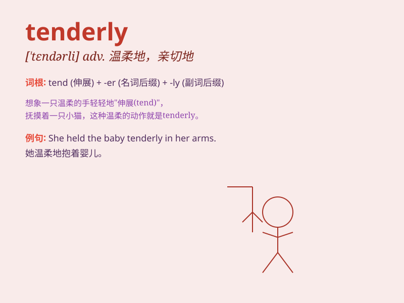

## tenderly

**英音:** _[ˈtɛndəli]_ **美音:** _[ˈtɛndərli]_

**译义:** *adv.温和地,体贴地*

### 短语

+ **speak tenderly:** _温柔地说话_

+ **hold tenderly:** _轻柔地握住_

+ **look tenderly:** _温柔地看着_

+ **touch tenderly:** _轻柔地触摸_

+ **kiss tenderly:** _温柔地亲吻_

### 例句

#### 例句1

> **He held her hand tenderly.**

**中文翻译:** 他温柔地握着她的手。

**单词释义:** 温柔地

#### 例句2

> **The mother tenderly kissed her baby\'s forehead.**

**中文翻译:** 母亲温柔地吻着孩子的额头。

**单词释义:** 温柔地

#### 例句3

> **She stroked the cat tenderly.**

**中文翻译:** 她温柔地抚摸着猫。

**单词释义:** 轻柔地

### 背诵小故事

> A little girl hurt her knee. Her father tended to the wound tenderly,
speaking soft words to comfort her. His gentle touch and caring gaze
showed his tender love.

**一个小女孩伤到了膝盖。她的父亲温柔地照料伤口，轻声说着安慰的话。他轻柔的抚摸和关切的目光显示出了他的温柔关爱。**

### 图义

