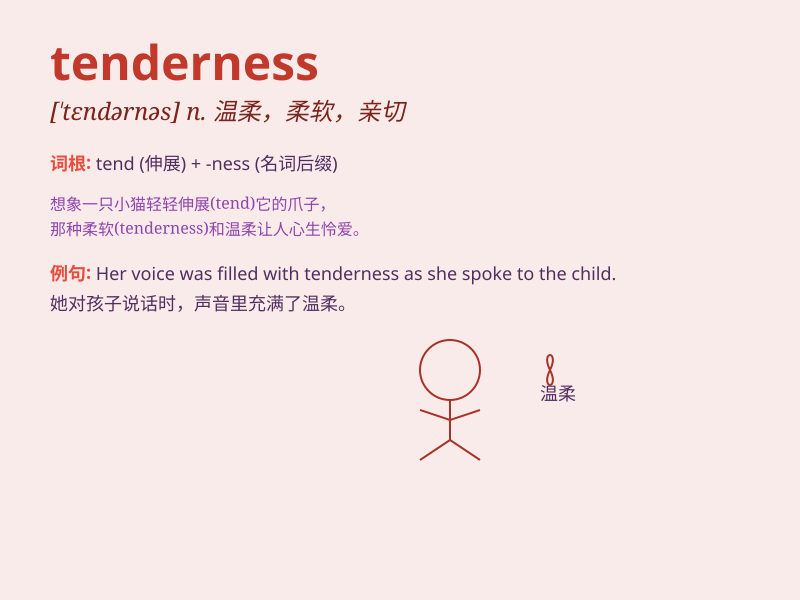

## tenderness

**英音:** _[\'tendənəs]_ **美音:** _[\'tɛndɚnɪs]_

**译义:** *n.嫩,亲切,柔和,敏感,棘手*

### 短语

+ **show tenderness:** _表现出温柔_

+ **feel tenderness:** _感到温柔_

+ **tenderness of heart:** _内心的温柔_

+ **overflow with tenderness:** _充满温柔_

+ **lack of tenderness:** _缺乏温柔_

### 例句

#### 例句1

> **The tenderness in her voice was comforting.**

**中文翻译:** 她声音里的温柔让人感到安慰。

**单词释义:** 温柔

#### 例句2

> **He showed tenderness towards his injured pet.**

**中文翻译:** 他对受伤的宠物表现出温柔。

**单词释义:** 温柔；柔情

#### 例句3

> **The doctor examined the area of tenderness on my leg.**

**中文翻译:** 医生检查了我腿上压痛的部位。

**单词释义:** 触痛；压痛

### 背诵小故事

> A little girl hurt her knee. Her mother showed tenderness by gently
cleaning the wound and giving her a warm hug. The mother\'s care and
love were full of tenderness.

**一个小女孩伤到了膝盖。她的妈妈表现出温柔，轻轻地清理伤口并给了她一个温暖的拥抱。妈妈的关心和爱充满了温柔。**

### 图义

