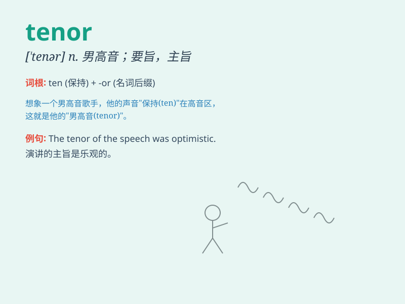

## tenor

**英音:** _[\'tenə]_ **美音:** _[\'tɛnɚ]_

**译义:** *n.进程,路程,要旨,大意,男高音,誊本adj.[音] 男高音的*

### 短语

+ **tenor saxophone:** _次中音萨克斯风_

+ **in the same tenor:** _以同样的方式；同样的论调_

+ **tenor voice:** _男高音；次中音_

+ **the tenor of life:** _生活的要旨；生活的趋向_

+ **tenor part:** _（乐曲的）次中音部_

### 例句

#### 例句1

> **The tenor of his speech was very positive.**

**中文翻译:** 他讲话的基调非常积极。

**单词释义:** 主旨；大意

#### 例句2

> **The tenor saxophone player gave a wonderful performance.**

**中文翻译:** 次中音萨克斯管演奏家带来了精彩的表演。

**单词释义:** 次中音（男高音）

#### 例句3

> **The tenor of their relationship changed after the argument.**

**中文翻译:** 争吵后，他们的关系发生了变化。

**单词释义:** 性质；特征

### 背诵小故事

> A tenor singer was invited to a big party. He had a beautiful voice.
Everyone was charmed by his tenor. It was a wonderful night.

**一位男高音歌手被邀请参加一个大型聚会。他有着美妙的嗓音。每个人都被他的男高音所吸引。那是一个美妙的夜晚。**

### 图义

