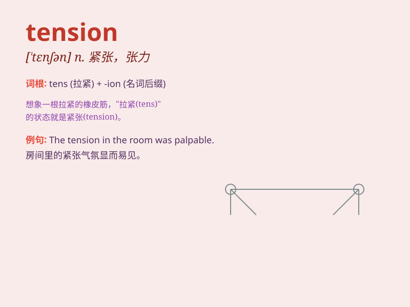

## tension

**英音:** _[\'tenʃ(ə)n]_ **美音:** _[\'tɛnʃən]_

**译义:**
*n.紧张(状态),不安,拉紧,压力,张力,牵力,电压vt.拉紧,使紧张*

### 短语

+ **high tension:** _高电压；高度紧张_

+ **tension spring:** _拉簧；张力弹簧_

+ **surface tension:** _表面张力_

+ **tension headache:** _紧张性头痛_

+ **voltage tension:** _电压_

### 例句

#### 例句1

> **The tension in the room was palpable as they waited for the
results.**

**中文翻译:** 当他们等待结果时，房间里的紧张气氛显而易见。

**单词释义:** 紧张；紧张局势

#### 例句2

> **The rope was under a lot of tension and finally snapped.**

**中文翻译:** 绳子受到很大的拉力，最后断了。

**单词释义:** 拉力；张力

#### 例句3

> **Relax and try to ease the tension in your muscles.**

**中文翻译:** 放松并尝试缓解肌肉的紧张。

**单词释义:** 紧张；紧绷

### 背诵小故事

> A tightrope walker was performing high above. The rope was under
great tension. Everyone held their breath, fearing it might snap. The
tension in the air was palpable as we watched, waiting for the thrilling
end.

**一位走钢丝的人在高空表演。钢丝承受着巨大的拉力。每个人都屏住呼吸，担心它会断裂。当我们观看时，空气中的紧张气氛是显而易见的，等待着激动人心的结局。**

### 图义

