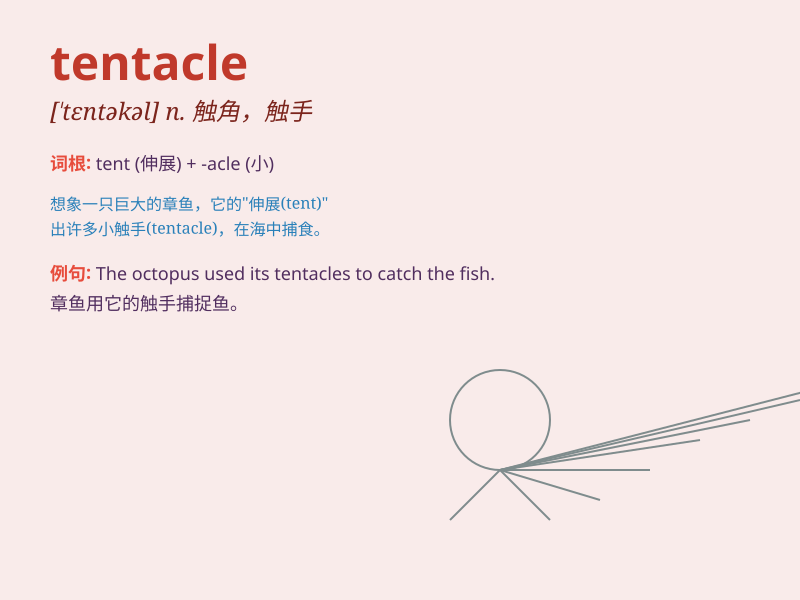

## tentacle

**英音:** _[\'tentək(ə)l]_ **美音:** _[\'tɛntəkl]_

**译义:** *n.(动物)触须、触角,(植物)腺毛*

### 短语

+ **tentacle movement:** _触手运动_

+ **tentacle extension:** _触手伸展_

+ **tentacle retraction:** _触手收缩_

+ **tentacle structure:** _触手结构_

+ **tentacle function:** _触手功能_

### 例句

#### 例句1

> **The octopus uses its tentacles to catch prey.**

**中文翻译:** 章鱼用触手捕捉猎物。

**单词释义:** 触手

#### 例句2

> **The plant\'s tentacles spread out in all directions.**

**中文翻译:** 植物的触手向四面八方展开。

**单词释义:** 触须

#### 例句3

> **The monster\'s tentacles reached out from the darkness.**

**中文翻译:** 怪物的触手从黑暗中伸出。

**单词释义:** 触手

### 背诵小故事

> A brave diver was exploring the deep sea. Suddenly, a huge octopus
appeared and its long tentacles reached out to catch the diver. But the
diver was smart and swam away quickly.

**一位勇敢的潜水员正在深海探索。突然，一只巨大的章鱼出现了，它长长的触手伸出来想要抓住潜水员。但潜水员很聪明，迅速游走了。**

### 图义

