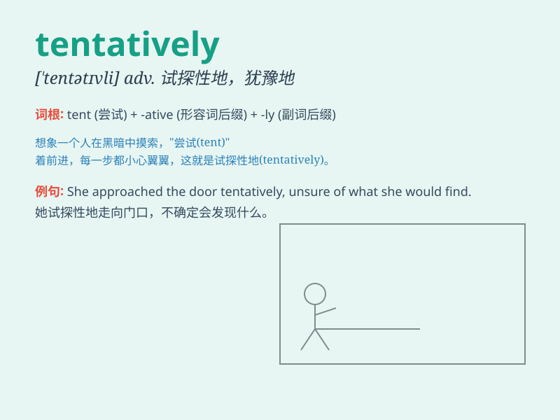

## tentatively

**英音:** _[ˈtɛntətɪvli]_ **美音:** _[ˈtɛntətɪvli]_

**译义:** *adv.试验性地,暂时地*

### 短语

+ **tentatively scheduled:** _暂定的安排_

+ **tentatively agreed:** _暂时同意_

+ **tentatively planned:** _初步计划_

+ **tentatively named:** _暂时命名_

+ **tentatively decided:** _暂时决定_

### 例句

#### 例句1

> **The date for the meeting was tentatively set for next Friday.**

**中文翻译:** 会议日期暂定于下周五。

**单词释义:** 暂时地；试探性地

#### 例句2

> **She tentatively reached out her hand to touch the flower.**

**中文翻译:** 她试探性地伸出手去触碰那朵花。

**单词释义:** 试探性地

#### 例句3

> **The plan was tentatively accepted by the committee.**

**中文翻译:** 该计划已被委员会暂时接受。

**单词释义:** 暂时地

### 背诵小故事

> A scientist was working on a new experiment. He tentatively proposed
a hypothesis and started to test it. He was cautious and not fully sure,
but was willing to explore. This showed his tentatively approach to the
unknown.

**一位科学家正在进行一项新实验。他暂时提出了一个假设并开始测试。他很谨慎，不是完全确定，但愿意去探索。这显示了他对未知事物的试探性态度。**

### 图义

