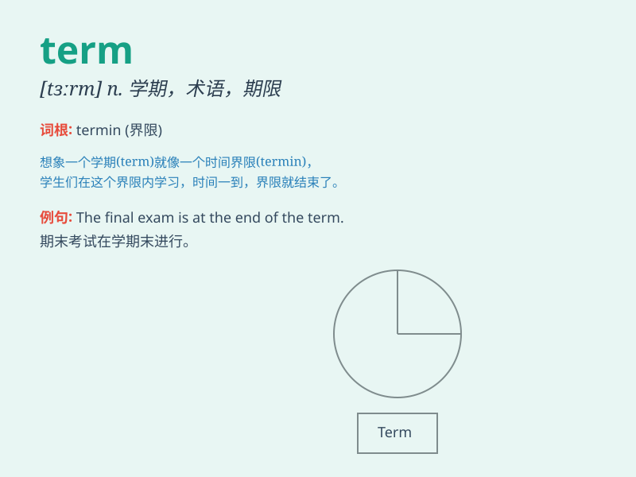

## term

**英音:** _[tɜːm]_ **美音:** _[tɝm]_

**译义:** *n.学期,期限,期间,条款,条件,术语*

### 短语

+ **in terms of:** _在...方面；从...角度看；根据...来说_

+ **long term:** _长期的_

+ **short term:** _短期的_

+ **come to terms:** _达成协议；妥协；让步_

+ **on good terms:** _关系好_

### 例句

#### 例句1

> **The term of the lease is two years.**

**中文翻译:** 租约的期限是两年。

**单词释义:** 期限；任期

#### 例句2

> **In this term, we will study advanced mathematics.**

**中文翻译:** 在这个学期，我们将学习高等数学。

**单词释义:** 学期

#### 例句3

> **The doctor used a medical term that I didn\'t understand.**

**中文翻译:** 医生使用了一个我不理解的医学术语。

**单词释义:** 术语；专门名词

### 背诵小故事

> 在学校的期末考试（term
exam）中，小明努力学习，因为他知道这一学期（term）的表现就看这次了。最终他取得了好成绩，明白了每个学期都是成长的重要阶段（term）。

**在学校的期末考试中，小明努力学习，因为他知道这一学期的表现就看这次了。最终他取得了好成绩，明白了每个学期都是成长的重要阶段。**

### 图义

