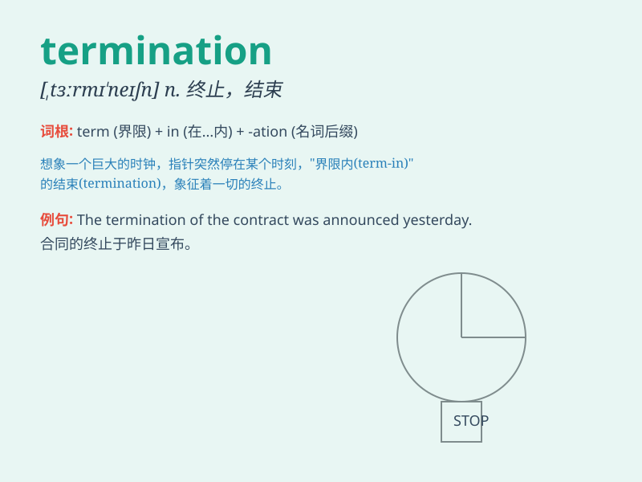

## termination

**英音:** _[tɜːmɪ\'neɪʃ(ə)n]_ **美音:**
_[\'tɝmə\'neʃən]_

**译义:** *n.终止*

### 短语

+ **job termination:** _工作终止_

+ **contract termination:** _合同终止_

+ **termination of lease:** _租约终止_

+ **termination benefits:** _解雇福利_

+ **termination notice:** _终止通知_

### 例句

#### 例句1

> **The termination of the contract was unexpected.**

**中文翻译:** 合同的终止出乎意料。

**单词释义:** 终止；结束

#### 例句2

> **She received notice of termination of employment.**

**中文翻译:** 她收到了雇佣关系终止的通知。

**单词释义:** 终止；结束

#### 例句3

> **The termination of the project was due to lack of funds.**

**中文翻译:** 这个项目的终止是由于缺乏资金。

**单词释义:** 终止；结束

### 背诵小故事

> A brave knight was on a quest to stop the termination of a magical
forest. But the evil wizard planned to end it. The knight fought hard
and finally saved the forest from this termination.

**一位勇敢的骑士正在执行一项任务，阻止一片神奇森林的终止。但邪恶的巫师计划终结它。骑士奋力战斗，最终使森林免遭这种终止。**

### 图义

