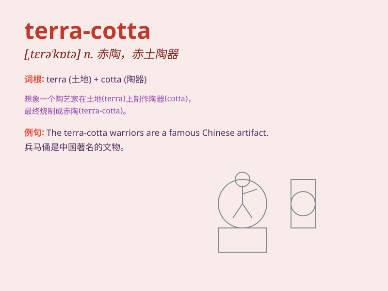

## terra-cotta

**英音:** _[ˈtɛrəkɒtə]_ **美音:** _[ˈtɛrəkɑtə]_

**译义:** *n.赤褐色,赤陶土,赤陶器adj.赤陶土制的,赤褐色的*

### 短语

+ **terra-cotta warrior:** _兵马俑_

+ **terra-cotta figure:** _赤陶塑像_

+ **terra-cotta tile:** _陶瓦_

+ **terra-cotta pot:** _赤陶花盆_

+ **terra-cotta ornament:** _赤陶装饰品_

### 例句

#### 例句1

> **The museum has an exquisite collection of terra-cotta
warriors.**

**中文翻译:** 这家博物馆有一批精美的兵马俑藏品。

**单词释义:** 赤陶；赤陶制品；赤褐色的

#### 例句2

> **She bought a beautiful terra-cotta vase for her living room.**

**中文翻译:** 她为客厅买了一个漂亮的赤陶花瓶。

**单词释义:** 赤陶；赤陶制品；赤褐色的

#### 例句3

> **The artist crafted a unique terra-cotta sculpture.**

**中文翻译:** 这位艺术家制作了一件独特的赤陶雕塑。

**单词释义:** 赤陶；赤陶制品；赤褐色的

### 背诵小故事

> A long time ago, in a faraway land, there was a special clay called
terra-cotta. This clay was used to make beautiful statues and pottery.
One day, a young artist discovered its magic and created wonderful works
with it.

**很久以前，在一个遥远的地方，有一种特殊的黏土叫赤陶土。这种黏土被用来制作美丽的雕像和陶器。有一天，一位年轻的艺术家发现了它的魔力，并以此创作了精彩的作品。**

### 图义

