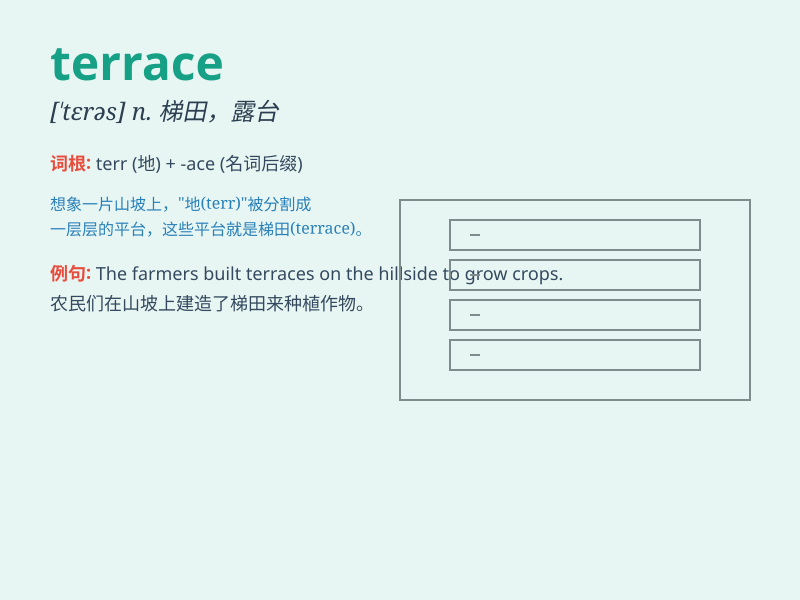

## terrace

**英音:** _[\'terəs]_ **美音:** _[ˈtɛrəs]_

**译义:** *n.梯田的一层,梯田,房屋之平顶,露台,阳台,倾斜的平地
adj.(女服)叠层式的vt.使成梯形地,使有平台屋顶*

### 短语

+ **roof terrace:** _屋顶平台_

+ **terrace house:** _排屋；联排房屋_

+ **garden terrace:** _花园露台_

+ **sea terrace:** _海阶；海蚀阶地_

+ **terrace farming:** _梯田农业；阶地耕作_

### 例句

#### 例句1

> **We sat on the terrace and enjoyed the beautiful view.**

**中文翻译:** 我们坐在露台上欣赏美丽的景色。

**单词释义:** 露台；平台

#### 例句2

> **The house has a large terrace at the back.**

**中文翻译:** 这所房子后面有一个大平台。

**单词释义:** 平台；露台

#### 例句3

> **The farmers terraced the hillside to grow rice.**

**中文翻译:** 农民们在山坡上修筑梯田种水稻。

**单词释义:** 使成梯田

### 背诵小故事

> A young artist loved to paint on the terrace of his house. Every day,
he would stand there, enjoying the view and creating beautiful art. The
terrace became his special place of inspiration.

**一位年轻的艺术家喜欢在他家的露台上作画。每天，他都会站在那里，欣赏风景并创作美丽的艺术。露台成了他特别的灵感之地。**

### 图义

