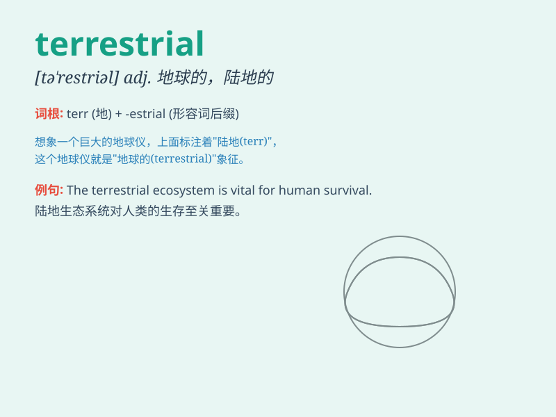

## terrestrial

**英音:** _[tə\'restrɪəl]_ **美音:** _[tə\'rɛstrɪəl]_

**译义:** *adj.陆地*

### 短语

+ **terrestrial ecosystem:** _陆地生态系统_

+ **terrestrial globe:** _地球仪_

+ **terrestrial heat:** _地热_

+ **terrestrial magnetism:** _地磁_

+ **terrestrial radiation:** _地面辐射_

### 例句

#### 例句1

> **Most living things are terrestrial.**

**中文翻译:** 大多数生物是陆生的。

**单词释义:** 陆生的

#### 例句2

> **The terrestrial globe is very beautiful.**

**中文翻译:** 这个地球仪很漂亮。

**单词释义:** 地球的；陆地的

#### 例句3

> **Some animals have adapted to a terrestrial lifestyle.**

**中文翻译:** 一些动物已经适应了陆地生活方式。

**单词释义:** 陆地的

### 背诵小故事

> Imagine a brave astronaut landing on a strange planet. He looks
around and realizes it\'s a terrestrial planet, with solid ground and
mountains. He says, \'This terrestrial place is so different from
space!\'

**想象一位勇敢的宇航员降落在一个陌生的星球上。他环顾四周，意识到这是一个类地行星，有坚实的地面和山脉。他说：'这个陆地般的地方和太空太不一样了！'**

### 图义

