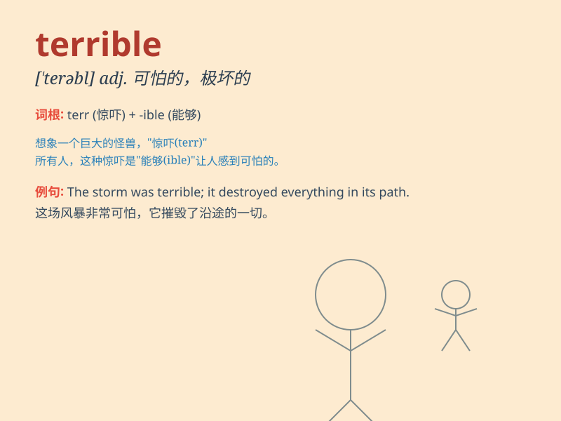

## terrible

**英音:** _[ˈterəbl]_ **美音:** _[\'tɛrəbl]_

**译义:** *adj.很糟的,极坏的,可怕的,骇人的*

### 短语

+ **terrible disaster:** _可怕的灾难_

+ **terrible pain:** _剧痛_

+ **terrible mistake:** _严重的错误_

+ **terrible weather:** _恶劣的天气_

+ **terrible accident:** _可怕的事故_

### 例句

#### 例句1

> **The weather is terrible today.**

**中文翻译:** 今天的天气很糟糕。

**单词释义:** 糟糕的

#### 例句2

> **He had a terrible accident last week.**

**中文翻译:** 他上周出了一场严重的事故。

**单词释义:** 严重的

#### 例句3

> **The food tastes terrible.**

**中文翻译:** 这食物味道很差。

**单词释义:** 差的，难吃的

### 背诵小故事

> One day, I was walking in a dark forest. Suddenly, a terrible storm
came. The wind was howling and the rain was pouring. I was so scared and
felt it was the most terrifying moment ever.

**有一天，我正在一片黑暗的森林里散步。突然，一场可怕的暴风雨来临了。狂风呼啸，大雨倾盆。我非常害怕，觉得这是有史以来最可怕的时刻。**

### 图义

