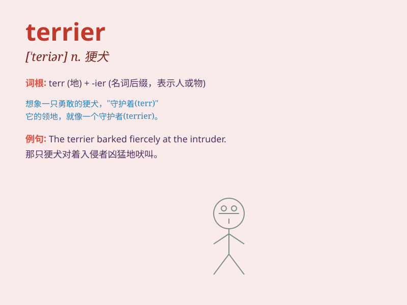

## terrier

**英音:** _[\'terɪə]_ **美音:** _[\'tɛrɪɚ]_

**译义:** *n.[动]狗的一种,国防自卫队,地籍册*

### 短语

+ **bull terrier:** _斗牛梗_

+ **Yorkshire terrier:** _约克夏梗_

+ **terrier dog:** _梗犬_

+ **wire-haired terrier:** _刚毛梗_

+ **smooth-haired terrier:** _光毛梗_

### 例句

#### 例句1

> **The terrier barked loudly at the stranger.**

**中文翻译:** 这只梗犬对着陌生人狂吠。

**单词释义:** 梗犬

#### 例句2

> **She has a cute little terrier as her pet.**

**中文翻译:** 她有一只可爱的小梗犬作为宠物。

**单词释义:** 梗犬

#### 例句3

> **The terrier is known for its energy and agility.**

**中文翻译:** 梗犬以其活力和敏捷而闻名。

**单词释义:** 梗犬

### 背诵小故事

> Once upon a time, there was a brave little terrier. It was always
energetic and not afraid of any difficulties. It protected its home and
owner with great loyalty. This little terrier became a hero in the
neighborhood.

**从前，有一只勇敢的小梗犬。它总是精力充沛，不怕任何困难。它非常忠诚地保护着它的家和主人。这只小梗犬成了邻里的英雄。**

### 图义

