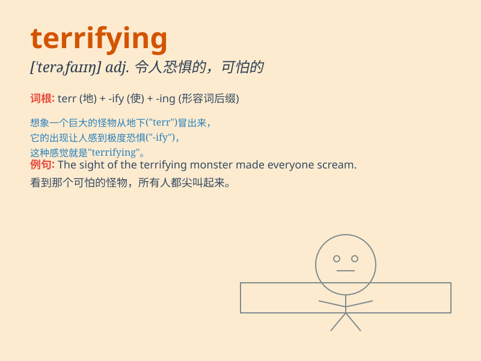

## terrifying

**英音:** _[ˈterɪfaɪɪŋ]_ **美音:** _[ˈtɛrəˌfaɪɪŋ]_

**译义:** *极大的, 可怕的*

### 短语

+ **terrifying experience:** _可怕的经历_

+ **terrifying sight:** _可怕的景象_

+ **terrifying thought:** _可怕的想法_

+ **terrifying scream:** _可怕的尖叫_

+ **terrifying story:** _恐怖的故事_

### 例句

#### 例句1

> **The horror movie was terrifying and gave me nightmares.**

**中文翻译:** 这部恐怖电影很吓人，让我做了噩梦。

**单词释义:** 令人恐惧的

#### 例句2

> **The thought of losing my job is terrifying.**

**中文翻译:** 想到会失去工作就让我感到恐惧。

**单词释义:** 令人害怕的

#### 例句3

> **The storm was so terrifying that people hid in their
basements.**

**中文翻译:** 这场风暴太可怕了，人们都躲在地下室里。

**单词释义:** 可怕的

### 背诵小故事

> One night, I was walking alone in a dark forest. Suddenly, a
terrifying monster appeared. Its sharp teeth and scary eyes made me
tremble with fear. I ran as fast as I could. The experience was truly
terrifying.

**一天晚上，我独自走在黑暗的森林里。突然，一只可怕的怪物出现了。它锋利的牙齿和吓人的眼睛让我害怕得发抖。我尽可能快地跑开了。这次经历真的太可怕了。**

### 图义

