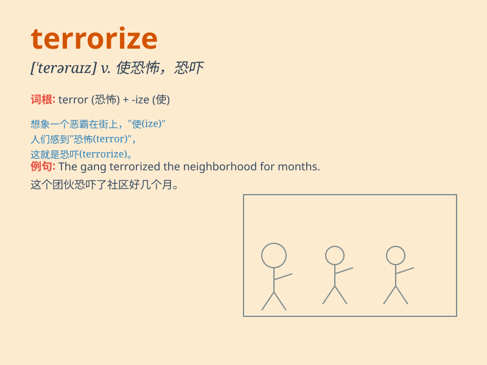

## terrorize

**英音:** _[ˈterəraɪz]_ **美音:** _[ˈterəraɪz]_

**译义:** *vt.使恐怖,恐吓,恐怖统治*

### 短语

+ **terrorize the neighborhood:** _恐吓周边地区_

+ **terrorize the population:** _使民众感到恐惧_

+ **be terrorized by something:** _被某物吓到_

+ **terrorize into submission:** _恐吓使其屈服_

+ **terrorize with threats:** _用威胁进行恐吓_

### 例句

#### 例句1

> **The gang terrorized the neighborhood by constantly stealing and
vandalizing.**

**中文翻译:** 这个团伙通过不断偷窃和破坏公物来恐吓周边地区。

**单词释义:** 恐吓，威胁

#### 例句2

> **The dictator terrorized the citizens with his harsh policies.**

**中文翻译:** 这位独裁者用他的严厉政策来恐吓市民。

**单词释义:** 使惊恐，使害怕

#### 例句3

> **The bully terrorized the younger students at school.**

**中文翻译:** 这个恶霸在学校恐吓低年级的学生。

**单词释义:** 胁迫，威吓

### 背诵小故事

> A gang of villains terrorized the small town. They broke into houses
at night, making people scream in terror. But finally, the brave police
caught them and ended the terrorizing.

**一群恶棍恐吓着这个小镇。他们在晚上闯入民宅，让人们惊恐尖叫。但最终，勇敢的警察抓住了他们，结束了这场恐吓。**

### 图义

