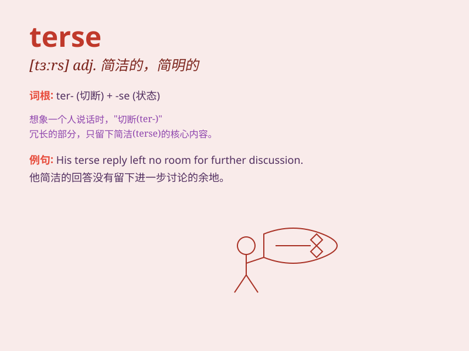

## terse

**英音:** _[tɜːs]_ **美音:** _[tɝs]_

**译义:** *adj.简洁的,扼要的*

### 短语

+ **terse reply:** _简短的回复_

+ **terse statement:** _简洁的陈述_

+ **terse communication:** _扼要的交流_

+ **terse message:** _简练的消息_

+ **terse explanation:** _简洁的解释_

### 例句

#### 例句1

> **His terse reply made me feel unwelcome.**

**中文翻译:** 他简短的回答让我感到不受欢迎。

**单词释义:** 简短的；扼要的

#### 例句2

> **The boss gave a terse order and everyone got to work.**

**中文翻译:** 老板下达了简洁的命令，然后每个人都开始工作。

**单词释义:** 简洁的；精练的

#### 例句3

> **She was known for her terse and to-the-point emails.**

**中文翻译:** 她以简洁明了、直切要点的电子邮件而闻名。

**单词释义:** 简洁的；扼要的

### 背诵小故事

> A boss was always terse when giving instructions. One day, an
employee misunderstood and made a mistake. The boss said sharply, \'Be
clear and terse to avoid confusion!\' It means being brief and to the
point.

**一位老板在下达指示时总是很简洁。有一天，一名员工误解并犯了错。老板严厉地说：\'要清晰、简洁，避免混淆！\'
这个词意思是简短扼要的。**

### 图义

