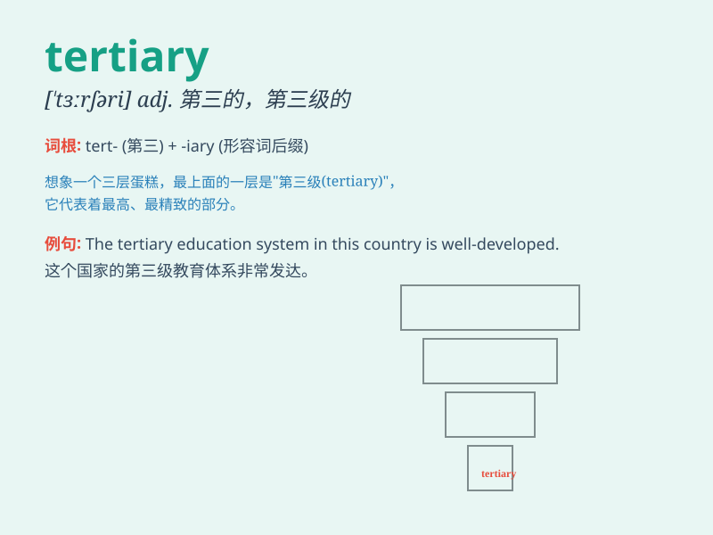

## tertiary

**英音:** _[\'tɜːʃ(ə)rɪ]_ **美音:** _[\'tɝʃɪ\'ɛri]_

**译义:**
*adj.第三的,第三位的,第三世纪的n.[画]第三色,第三修道会会员,[地]第三纪*

### 短语

+ **tertiary industry:** _第三产业_

+ **tertiary education:** _高等教育；大学教育_

+ **tertiary structure:** _三级结构；（蛋白质的） tertiary 结构_

+ **tertiary amine:** _叔胺_

+ **tertiary sector:** _第三部门；服务业_

### 例句

#### 例句1

> **The tertiary sector of the economy is growing rapidly.**

**中文翻译:** 经济的第三产业正在迅速发展。

**单词释义:** 第三的；第三位的；第三级的

#### 例句2

> **She is pursuing a tertiary education to enhance her career
prospects.**

**中文翻译:** 她正在接受高等教育以提高自己的职业前景。

**单词释义:** 高等教育的；大学教育的

#### 例句3

> **Tertiary colors are mixtures of primary and secondary colors.**

**中文翻译:** 第三色是原色和间色的混合色。

**单词释义:** 第三的；第三位的

### 背诵小故事

> A student was confused about his future. He didn\'t know if he should
go for primary or secondary education. Then a wise teacher told him
about the tertiary education, which opened his mind to new possibilities
like college and university.

**一名学生对自己的未来感到困惑。他不知道该选择初等教育还是中等教育。然后一位睿智的老师给他讲了高等教育，这让他看到了像大学这样的新可能。**

### 图义

