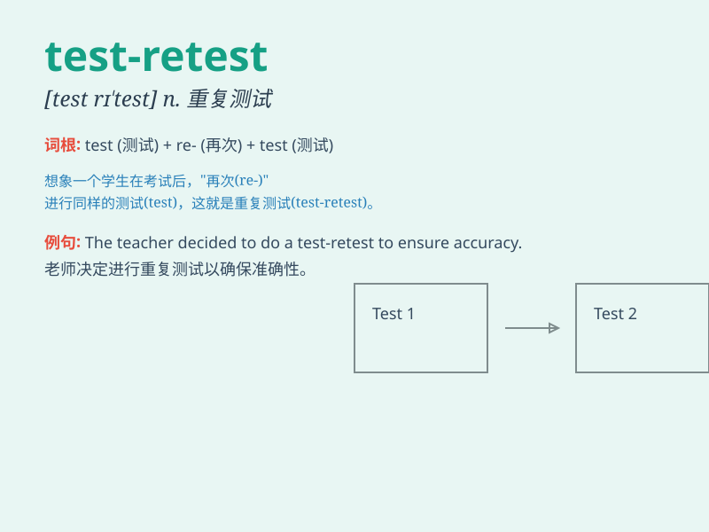

## test-retest

**英音:** __ **美音:** __

**译义:** *n. 重测；再测*

### 短语

+ **test-retest reliability:** _重测信度_

+ **test-retest method:** _重测法_

+ **test-retest correlation:** _重测相关_

+ **test-retest consistency:** _重测一致性_

+ **test-retest validation:** _重测验证_

### 例句

#### 例句1

> **The test-retest reliability of the new psychological assessment
tool was evaluated.**

**中文翻译:** 对新的心理评估工具的重测信度进行了评估。

**单词释义:** 重测（用于描述对同一测试进行再次测试以评估其可靠性）

#### 例句2

> **We need to conduct a test-retest to ensure the accuracy of the
results.**

**中文翻译:** 我们需要进行重测以确保结果的准确性。

**单词释义:** 重测（强调为了验证而再次进行测试）

#### 例句3

> **The test-retest method is commonly used in scientific
research.**

**中文翻译:** 重测方法在科学研究中被普遍使用。

**单词释义:** 重测（指一种常见的研究手段）

### 背诵小故事

> A scientist conducted an experiment and got the result in the first
test. But to ensure accuracy, he did the test-retest. Finally, he was
confident with the reliable data.

**一位科学家进行了一项实验，并在第一次测试中得到了结果。但为了确保准确性，他进行了重测。最后，他对可靠的数据充满信心。**

### 图义

