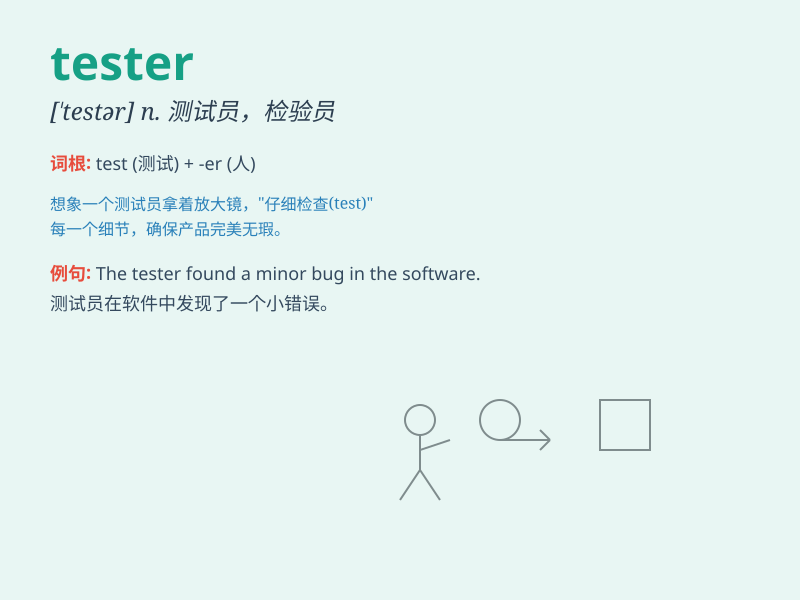

## tester

**英音:** _[\'testə]_ **美音:** _[\'tɛstɚ]_

**译义:** *n.考试者,试验装置,检测器,华盖*

### 短语

+ **voltage tester:** _电压测试仪_

+ **hardness tester:** _硬度测试仪_

+ **stress tester:** _应力测试仪_

+ **leakage tester:** _漏电测试仪_

+ **circuit tester:** _电路测试仪_

### 例句

#### 例句1

> **The tester checked the functionality of the new software.**

**中文翻译:** 测试员检查了新软件的功能。

**单词释义:** 测试员

#### 例句2

> **This machine is a powerful tester for electronic components.**

**中文翻译:** 这台机器是用于电子元件的强大测试器。

**单词释义:** 测试器

#### 例句3

> **She works as a quality tester in the factory.**

**中文翻译:** 她在工厂里担任质量测试员。

**单词释义:** 测试员

### 背诵小故事

> One day, a mysterious box arrived. Everyone was curious. A brave
person stepped forward and said, \'I\'ll be the tester.\' He opened the
box carefully and discovered wonderful gifts inside. The tester made
everyone happy.

**有一天，一个神秘的盒子到了。大家都很好奇。一个勇敢的人站出来说：'我来当测试员。'他小心地打开盒子，发现里面有很棒的礼物。这个测试员让大家都很开心。**

### 图义

