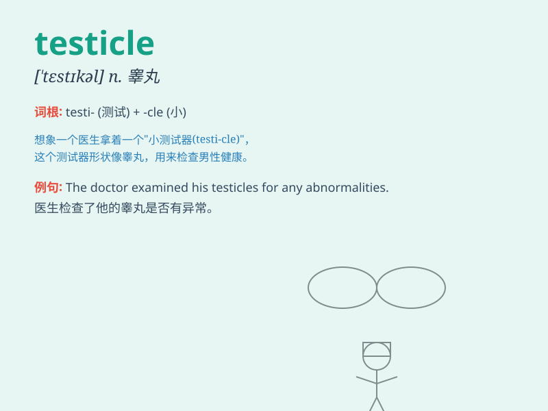

## testicle

**英音:** _[\'testɪk(ə)l]_ **美音:** _[\'tɛstɪkl]_

**译义:** *n.[解]睾丸*

### 短语

+ **testicle cancer:** _睾丸癌_

+ **testicle injury:** _睾丸损伤_

+ **testicle pain:** _睾丸疼痛_

+ **testicle swelling:** _睾丸肿胀_

+ **testicle torsion:** _睾丸扭转_

### 例句

#### 例句1

> **The doctor examined his testicles for any abnormalities.**

**中文翻译:** 医生检查了他的睾丸是否有任何异常。

**单词释义:** 睾丸

#### 例句2

> **He experienced pain in his testicles after the accident.**

**中文翻译:** 事故后，他的睾丸感到疼痛。

**单词释义:** 睾丸

#### 例句3

> **The cancer affected one of his testicles.**

**中文翻译:** 癌症影响了他的一个睾丸。

**单词释义:** 睾丸

### 背诵小故事

> A man was very worried about his testicles. He went to the doctor and
asked for a test. The doctor assured him that his testicles were fine.
Remember, testicle means one of the two male reproductive glands.

**一个男人非常担心他的睾丸。他去看医生并要求检查。医生向他保证他的睾丸没问题。记住，testicle
意思是两个男性生殖腺中的一个。**

### 图义

