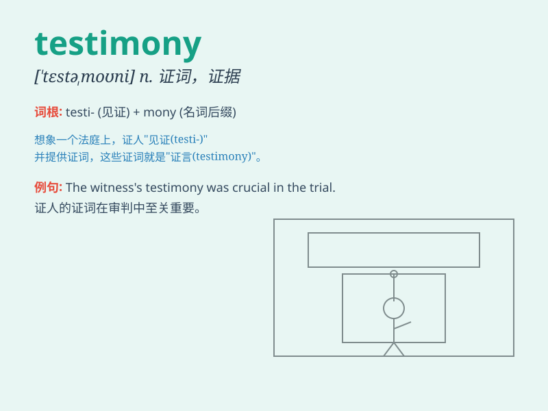

## testimony

**英音:** _[\'testɪmənɪ]_ **美音:** _[\'tɛstə\'moni]_

**译义:** *n.证词(尤指在法庭所作的),宣言,陈述*

### 短语

+ **eyewitness testimony:** _目击证人的证词_

+ **expert testimony:** _专家证词_

+ **testimony evidence:** _证词证据_

+ **give testimony:** _提供证词_

+ **corroborating testimony:** _确证的证词_

### 例句

#### 例句1

> **The witness\'s testimony was crucial in the trial.**

**中文翻译:** 证人的证词在审判中至关重要。

**单词释义:** 证词

#### 例句2

> **Her testimony contradicted his statement.**

**中文翻译:** 她的证词与他的陈述相矛盾。

**单词释义:** 证词

#### 例句3

> **The expert\'s testimony provided valuable evidence.**

**中文翻译:** 专家的证词提供了有价值的证据。

**单词释义:** 证词

### 背诵小故事

> A brave detective was on a difficult case. The only key to solve it
was the testimony of a witness. The witness was scared but finally spoke
the truth. That testimony helped the detective catch the criminal.

**一位勇敢的侦探在处理一个棘手的案件。解决它的唯一关键是一位证人的证词。证人很害怕，但最终说出了真相。那份证词帮助侦探抓住了罪犯。**

### 图义

