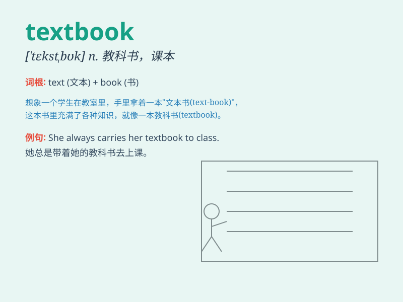

## textbook

**英音:** _[\'teks(t)bʊk]_ **美音:** _[\'tɛkstbʊk]_

**译义:** *n.教科书,课本adj.合乎规范的*

### 短语

+ **textbook example:** _典型的例子_

+ **textbook case:** _典型案例_

+ **textbook knowledge:** _书本知识_

+ **old textbook:** _旧教科书_

+ **new textbook:** _新教科书_

### 例句

#### 例句1

> **This textbook is very useful for students.**

**中文翻译:** 这本教科书对学生非常有用。

**单词释义:** 教科书

#### 例句2

> **The teacher referred to the textbook frequently during the
lecture.**

**中文翻译:** 老师在讲课过程中经常参考这本教科书。

**单词释义:** 教科书

#### 例句3

> **I need to buy a new textbook for the upcoming semester.**

**中文翻译:** 我需要为即将到来的学期买一本新的教科书。

**单词释义:** 教科书

### 背诵小故事

> One day, Tom was looking for a useful book. He found a thick one
filled with texts and exercises. It was a textbook that helped him learn
a lot. With it, Tom improved his knowledge greatly.

**有一天，汤姆在找一本有用的书。他发现了一本厚厚的，充满了文字和练习的书。这是一本教科书，帮助他学到了很多。有了它，汤姆极大地提高了他的知识。**

### 图义

