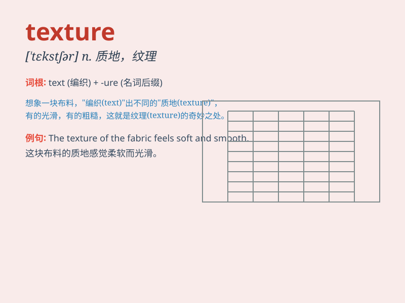

## texture

**英音:** _[\'tekstʃə]_ **美音:** _[\'tɛkstʃɚ]_

**译义:**
*n.(织品的)质地,(木材,岩石等的)纹理,(皮肤)肌理,(文艺作品)结构*

### 短语

+ **surface texture:** _表面质地_

+ **fine texture:** _细腻的质地_

+ **coarse texture:** _粗糙的质地_

+ **textural analysis:** _质地分析_

+ **textured fabric:** _有纹理的织物_

### 例句

#### 例句1

> **The texture of the fabric was smooth and soft.**

**中文翻译:** 这种织物的质地光滑柔软。

**单词释义:** 质地；纹理

#### 例句2

> **The cake had a rich and moist texture.**

**中文翻译:** 这个蛋糕有丰富且湿润的口感。

**单词释义:** 口感

#### 例句3

> **The artist paid close attention to the texture of the skin in the
portrait.**

**中文翻译:** 这位艺术家在肖像画中密切关注皮肤的纹理。

**单词释义:** 纹理

### 背诵小故事

> A brave explorer was in a cave. He touched the wall and felt a
strange texture. It was rough and bumpy. He realized this texture could
help him find the way out.

**一位勇敢的探险家在一个洞穴里。他触摸墙壁，感觉到一种奇怪的质地。它粗糙且凹凸不平。他意识到这种质地可以帮助他找到出路。**

### 图义

