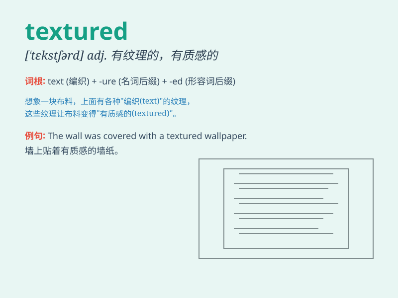

## textured

**英音:** _[ˈtekstʃəd]_ **美音:** _[ˈtekstʃərd]_

**译义:** *adj.织地粗糙的,手摸时有感觉的,有织纹的*

### 短语

+ **textured fabric:** _有纹理的织物_

+ **textured wallpaper:** _有纹理的壁纸_

+ **textured surface:** _有纹理的表面_

+ **fine-textured:** _质地优良的_

+ **coarse-textured:** _质地粗糙的_

### 例句

#### 例句1

> **The fabric has a richly textured surface.**

**中文翻译:** 这种织物有着质地丰富的表面。

**单词释义:** 有纹理的；质地不平的

#### 例句2

> **The textured wallpaper gives the room a unique look.**

**中文翻译:** 有纹理的壁纸让房间呈现出独特的外观。

**单词释义:** 有纹理的

#### 例句3

> **The artist used textured paint to create a special effect on the
canvas.**

**中文翻译:** 这位艺术家使用有纹理的颜料在画布上创造出一种特殊效果。

**单词释义:** 有纹理的

### 背诵小故事

> One day, I was painting a picture. I wanted to show the textured
surface of a fruit. So, I carefully chose different brushstrokes to
create that special effect. Finally, the textured fruit looked so real!

**有一天，我在画画。我想展现一个水果的纹理表面。所以，我仔细地选择不同的笔触来创造那种特殊效果。最后，有纹理的水果看起来如此逼真！**

### 图义

