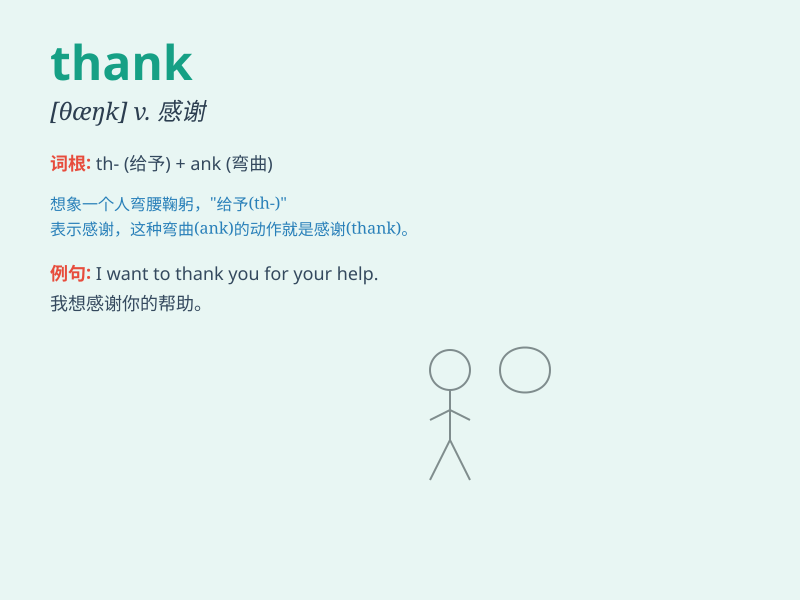

## thank

**英音:** _[θæŋk]_ **美音:** _[θæŋk]_

**译义:** *vt.感谢,用于表示强制的要求,用将来时*

### 短语

+ **thank you:** _谢谢你_

+ **thank goodness:** _谢天谢地_

+ **thanks a lot:** _非常感谢_

+ **thank heavens:** _谢天谢地_

+ **thank someone for something:** _为某事感谢某人_

### 例句

#### 例句1

> **Thank you for your help.**

**中文翻译:** 感谢你的帮助。

**单词释义:** 感谢

#### 例句2

> **I must thank him for that.**

**中文翻译:** 我必须为那件事感谢他。

**单词释义:** 感谢

#### 例句3

> **Thank goodness it\'s Friday.**

**中文翻译:** 谢天谢地，今天是星期五。

**单词释义:** 谢天谢地

### 背诵小故事

> One day, when I was lost in a strange city, a kind man showed me the
way. I was so grateful and said \'Thank you\' to him. His smile made me
understand that a simple thank can bring warmth.

**有一天，当我在一个陌生的城市迷路时，一位善良的男士给我指了路。我非常感激，并对他说'谢谢你'。他的微笑让我明白，一句简单的谢谢能带来温暖。**

### 图义

