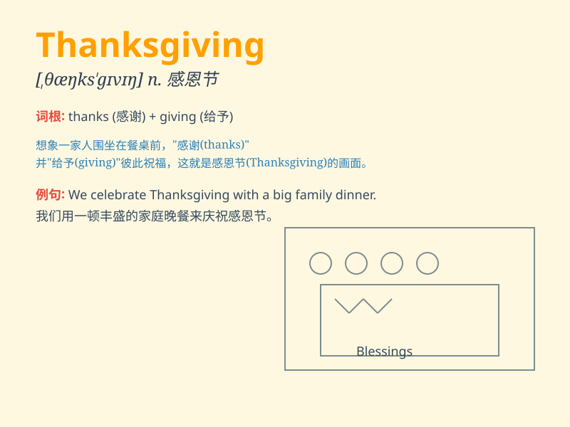

## Thanksgiving

**英音:** _[ˈθæŋksgɪvɪŋ]_ **美音:** _[ˈθæŋksˌɡɪvɪŋ]_

**译义:** *n.感恩节；感谢；感恩祷告会*

### 短语

+ **Thanksgiving Day:** _感恩节_

+ **Thanksgiving dinner:** _感恩节晚餐_

+ **Thanksgiving feast:** _感恩节盛宴_

+ **Thanksgiving vacation:** _感恩节假期_

+ **Thanksgiving turkey:** _感恩节火鸡_

### 例句

#### 例句1

> **Thanksgiving is a time for family gatherings and feasts.**

**中文翻译:** 感恩节是家庭团聚和盛宴的时刻。

**单词释义:** 感恩节

#### 例句2

> **We always have turkey on Thanksgiving.**

**中文翻译:** 我们在感恩节总是吃火鸡。

**单词释义:** 感恩节

#### 例句3

> **Thanksgiving is a special holiday in the United States.**

**中文翻译:** 感恩节在美国是一个特殊的节日。

**单词释义:** 感恩节

### 背诵小故事

> One year, a family faced many difficulties but still had a warm meal
together on Thanksgiving. They gave thanks for what they had and shared
love. This made them stronger and happier. Remember, Thanksgiving is
about gratitude and togetherness.

**有一年，一个家庭面临诸多困难，但在感恩节仍一起享用了温暖的一餐。他们为所拥有的表示感恩并分享爱。这让他们更强大和快乐。记住，感恩节是关于感恩和团聚。**

### 图义

