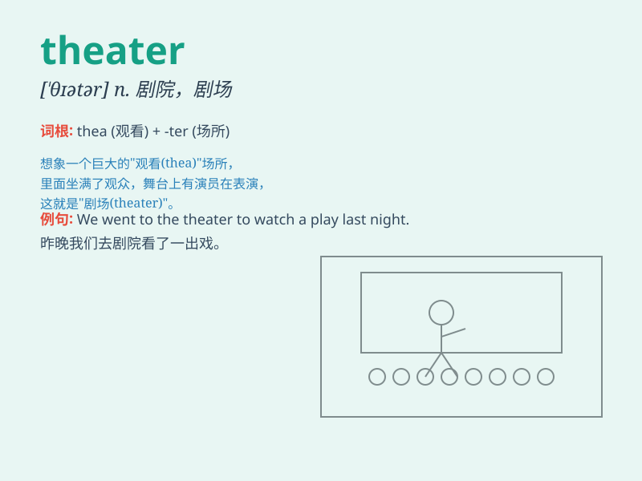

## theater

**英音:** _[\'θɪətə]_ **美音:** _[ˈθiədər]_

**译义:**
*n.剧场,戏院,电影院,阶梯教室,手术教室,手术室,全体观众,戏剧*

### 短语

+ **movie theater:** _电影院_

+ **theater district:** _剧院区_

+ **community theater:** _社区剧院_

+ **theater company:** _剧团_

+ **theater stage:** _剧院舞台_

### 例句

#### 例句1

> **I went to the theater to watch a play last night.**

**中文翻译:** 昨晚我去剧院看了一场戏剧。

**单词释义:** 剧院

#### 例句2

> **The new theater in town has state-of-the-art facilities.**

**中文翻译:** 镇上的新剧院拥有最先进的设施。

**单词释义:** 剧院

#### 例句3

> **She dreams of performing on the Broadway theater one day.**

**中文翻译:** 她梦想有一天能在百老汇剧院演出。

**单词释义:** 剧院

### 背诵小故事

> One day, I was lost in a big city. Suddenly, I saw a sign that said
\'theater\'. I followed it and found a wonderful place full of music and
drama. It was a magical experience.

**有一天，我在一个大城市里迷路了。突然，我看到一个写着'剧院'的标志。我跟着它，发现了一个充满音乐和戏剧的美妙地方。这是一次神奇的经历。**

### 图义

