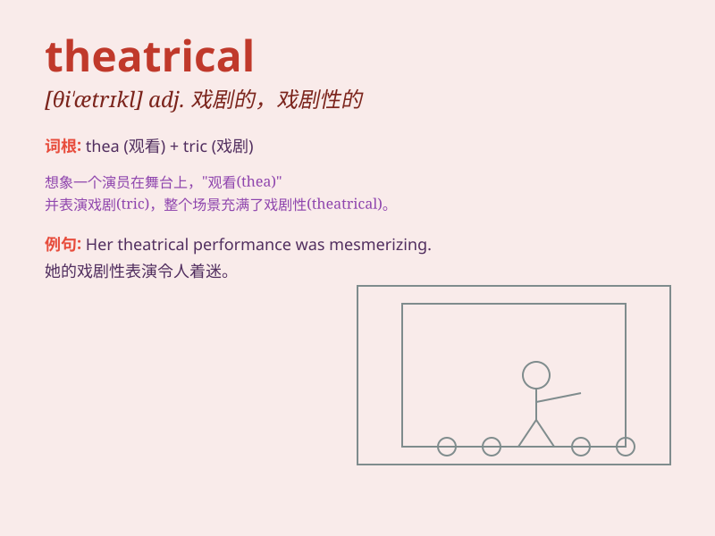

## theatrical

**英音:** _[θɪ\'ætrɪk(ə)l]_ **美音:** _[θɪ\'ætrɪkl]_

**译义:** *adj.戏剧性的*

### 短语

+ **theatrical performance:** _戏剧表演_

+ **theatrical costume:** _戏剧服装_

+ **theatrical makeup:** _戏剧化妆_

+ **theatrical gesture:** _戏剧手势_

+ **theatrical scene:** _戏剧场景_

### 例句

#### 例句1

> **She has a very theatrical way of speaking.**

**中文翻译:** 她说话的方式非常夸张。

**单词释义:** 夸张的；戏剧化的

#### 例句2

> **The theatrical performance was a huge success.**

**中文翻译:** 这场戏剧演出取得了巨大的成功。

**单词释义:** 戏剧的；剧场的

#### 例句3

> **He made a theatrical gesture to emphasize his point.**

**中文翻译:** 他做了一个夸张的手势来强调他的观点。

**单词释义:** 做作的；装腔作势的

### 背诵小故事

> A young actor was very theatrical. He always exaggerated his
expressions and movements on the stage. But his theatrical performance
finally won him the lead role.

**一个年轻的演员非常戏剧化。他在舞台上总是夸张他的表情和动作。但他戏剧化的表演最终为他赢得了主角。**

### 图义

