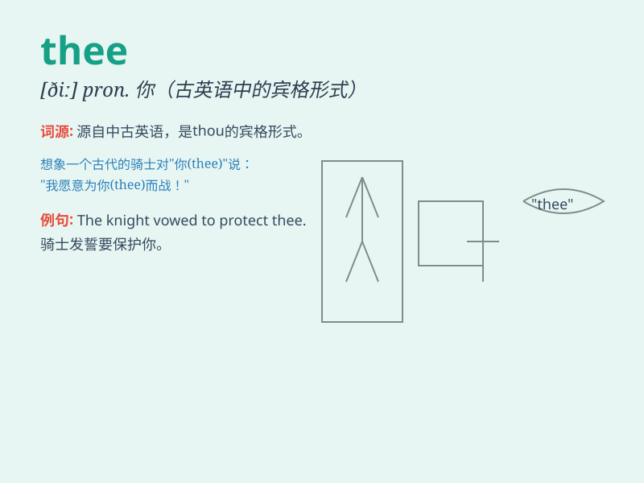

## thee

**英音:** _[ðiː]_ **美音:** _[ði]_

**译义:** * pron.\<古>(thou的宾格)你*

### 短语

+ **honour thee:** _尊敬你_

+ **bless thee:** _保佑你_

+ **praise thee:** _赞美你_

+ **thank thee:** _感谢你_

+ **curse thee:** _诅咒你_

### 例句

#### 例句1

> **I love thee with all my heart.**

**中文翻译:** 我全心全意地爱你。

**单词释义:** 你（古英语，宾格）

#### 例句2

> **Bless thee, my child.**

**中文翻译:** 祝福你，我的孩子。

**单词释义:** 你（古英语，宾格）

#### 例句3

> **Fear not, thee shall be safe.**

**中文翻译:** 别害怕，你会安全的。

**单词释义:** 你（古英语，宾格）

### 背诵小故事

> 在一个古老的小镇，一位诗人对着心爱的姑娘深情吟唱：\'Thee, my dear,
are the light of my life.\'
意思就是'你，亲爱的，是我生命中的光。'这里的thee就是'你'的意思，是一种比较古老或诗意的表达。

**在一个古老的小镇，一位诗人对着心爱的姑娘表达，这里的thee就是'你'的意思，是一种古老或诗意的表达。**

### 图义

