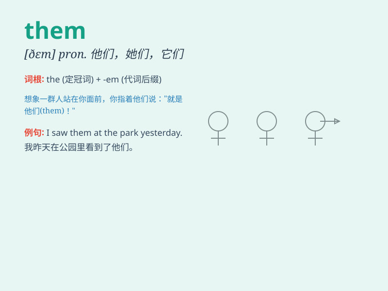

## them

**英音:** _[ðem; ðəm]_ **美音:** _[ðɛm; ðəm]_

**译义:** * pron.[they 的宾格] 他们,她们,它们*

### 短语

+ **one of them:** _他们中的一个_

+ **all of them:** _他们全部_

+ **most of them:** _他们中的大多数_

+ **none of them:** _他们中没有一个_

+ **tell them:** _告诉他们_

### 例句

#### 例句1

> **I like them very much.**

**中文翻译:** 我非常喜欢他们。

**单词释义:** 他们；她们；它们（宾格）

#### 例句2

> **We should help them.**

**中文翻译:** 我们应该帮助他们。

**单词释义:** 他们；她们；它们（宾格）

#### 例句3

> **Don\'t blame them.**

**中文翻译:** 不要责怪他们。

**单词释义:** 他们；她们；它们（宾格）

### 背诵小故事

> One day, Tom was looking for his toys. He found them under the bed.
He was very happy. The toys were not lost. \'Them\' refers to the toys
in this story.

**有一天，汤姆在找他的玩具。他在床底下找到了它们。他非常高兴。玩具没有丢。在这个故事中，'them'指的就是那些玩具。**

### 图义

