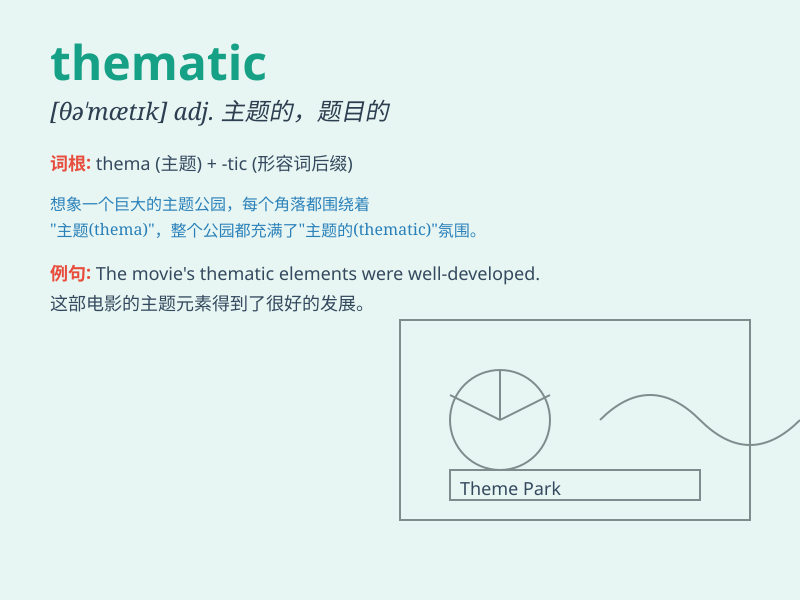

## thematic

**英音:** _[θɪ\'mætɪk]_ **美音:** _[θɪ\'mætɪk]_

**译义:** *adj.词干的,题目的,主题的,论题的*

### 短语

+ **thematic analysis:** _主题分析_

+ **thematic map:** _专题地图_

+ **thematic approach:** _主题教学法_

+ **thematic content:** _主题内容_

+ **thematic study:** _专题研究_

### 例句

#### 例句1

> **The thematic focus of the conference was on environmental
protection.**

**中文翻译:** 这次会议的主题重点是环境保护。

**单词释义:** 主题的；题目的

#### 例句2

> **The novel has a strong thematic unity.**

**中文翻译:** 这部小说有很强的主题统一性。

**单词释义:** 主题的

#### 例句3

> **The teacher organized the lessons based on thematic units.**

**中文翻译:** 老师根据主题单元组织课程。

**单词释义:** 主题的

### 背诵小故事

>
想象一个探险家在神秘的森林中寻找宝藏，他的地图上有各种主题标记，如河流、山峰等。这些主题标记（thematic
marks）帮助他规划路线，最终找到了宝藏。所以\'thematic\'就是与主题相关的意思。

**想象一位探险家在森林中依靠主题标记寻找宝藏来理解\'thematic\'意为与主题相关的**

### 图义

