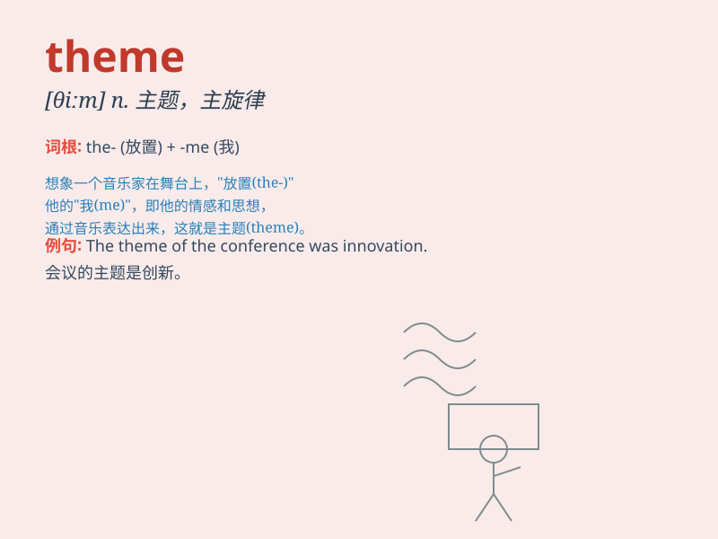

## theme

**英音:** _[θiːm]_ **美音:** _[θim]_

**译义:** *n.(谈话,写作等的)题目,主题,学生的作文,作文题,[音乐]
主题,主题曲,主旋律*

### 短语

+ **theme park:** _主题公园_

+ **theme song:** _主题歌；主题曲_

+ **main theme:** _主题；主旋律_

+ **theme music:** _主题音乐_

+ **common theme:** _共同主题_

### 例句

#### 例句1

> **The theme of the party was \'Retro Disco\'.**

**中文翻译:** 这次聚会的主题是'复古迪斯科'。

**单词释义:** 主题

#### 例句2

> **The book explores the theme of love and betrayal.**

**中文翻译:** 这本书探讨了爱与背叛的主题。

**单词释义:** 主题

#### 例句3

> **The theme song of the movie is very catchy.**

**中文翻译:** 这部电影的主题曲非常动听。

**单词释义:** 主题；主题曲

### 背诵小故事

> Imagine a big party. Everyone is dressed in the same color and style.
That common color and style are the \'theme\' of the party. It ties
everything together and makes the party special.

**想象一个盛大的派对。每个人都穿着相同的颜色和款式。那种共同的颜色和款式就是派对的"主题"。它将一切联系在一起，使派对变得特别。**

### 图义

