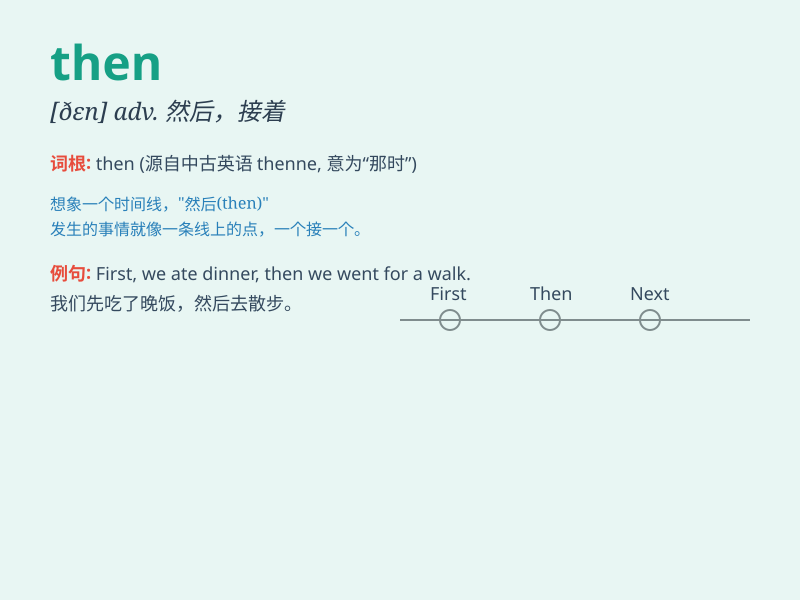

## then

**英音:** _[ðen]_ **美音:** _[ðɛn]_

**译义:** *adv.当时,在那时,那么,因而,然后,于是*

### 短语

+ **by then:** _到那时_

+ **since then:** _从那时起_

+ **till then:** _直到那时_

+ **even then:** _即使在那时_

+ **and then:** _然后；其次_

### 例句

#### 例句1

> **I was tired then.**

**中文翻译:** 那时我累了。

**单词释义:** 那时

#### 例句2

> **If you\'re busy now, then we can talk later.**

**中文翻译:** 如果你现在忙，那么我们可以稍后谈。

**单词释义:** 那么

#### 例句3

> **First come, then serve.**

**中文翻译:** 先到先服务。

**单词释义:** 然后

### 背诵小故事

> One day, I was lost in a strange city. I didn\'t know where to go.
Then, a kind policeman showed up and helped me find my way. \'Then\'
here means at that time or next.

**有一天，我在一个陌生的城市迷路了。我不知道该往哪儿走。然后，一位善良的警察出现了，帮我找到了路。这里的\'then\'意思是在那时或接下来。**

### 图义

