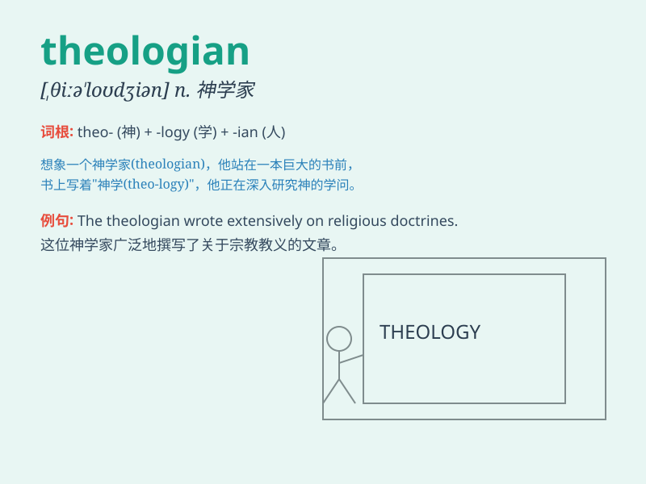

## theologian

**英音:** _[θɪə\'ləʊdʒɪən; -dʒ(ə)n]_ **美音:**
_[,θiə\'lodʒən]_

**译义:** *n.神学者,空头理论家*

### 短语

+ **Christian theologian:** _基督教神学家_

+ **prominent theologian:** _杰出的神学家_

+ **theologian\'s theory:** _神学家的理论_

+ **contemporary theologian:** _当代神学家_

+ **renowned theologian:** _著名的神学家_

### 例句

#### 例句1

> **The theologian spent years studying religious scriptures.**

**中文翻译:** 这位神学家花费了数年时间研究宗教经典。

**单词释义:** 神学家

#### 例句2

> **She consulted a renowned theologian for guidance on spiritual
matters.**

**中文翻译:** 她向一位著名的神学家咨询有关精神事务的指导。

**单词释义:** 神学家

#### 例句3

> **The theologian\'s work has had a profound impact on modern
religious thought.**

**中文翻译:** 这位神学家的作品对现代宗教思想产生了深远的影响。

**单词释义:** 神学家

### 背诵小故事

> A young man was lost in thought about the meaning of life and the
existence of God. He read countless books and debated with many.
Eventually, he became a renowned theologian, seeking answers to profound
spiritual questions.

**一个年轻人陷入了对生命意义和上帝存在的思考。他读了无数的书，并与许多人辩论。最终，他成为了一位著名的神学家，寻求深刻的精神问题的答案。**

### 图义

