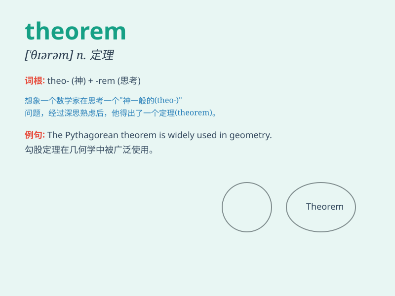

## theorem

**英音:** _[\'θɪərəm]_ **美音:** _[\'θiərəm]_

**译义:** *n.[数]定理,法则*

### 短语

+ **mathematical theorem:** _数学定理_

+ **fundamental theorem:** _基本定理_

+ **proven theorem:** _已证明的定理_

+ **complex theorem:** _复杂的定理_

+ **theorem statement:** _定理陈述_

### 例句

#### 例句1

> **The Pythagorean Theorem is widely used in mathematics.**

**中文翻译:** 毕达哥拉斯定理在数学中被广泛应用。

**单词释义:** 定理

#### 例句2

> **He spent hours trying to prove the theorem.**

**中文翻译:** 他花了好几个小时试图证明这个定理。

**单词释义:** 定理

#### 例句3

> **The new theorem simplifies the complex problem.**

**中文翻译:** 这个新定理简化了这个复杂的问题。

**单词释义:** 定理

### 背诵小故事

> A brilliant scientist was constantly working in his lab. One day, he
discovered a new THEOREM that would change the world. It was like
finding a hidden key to unlock many mysteries.

**一位杰出的科学家一直在他的实验室工作。有一天，他发现了一个新的定理，这个定理将会改变世界。这就像找到了一把隐藏的钥匙来解开许多谜团。**

### 图义

