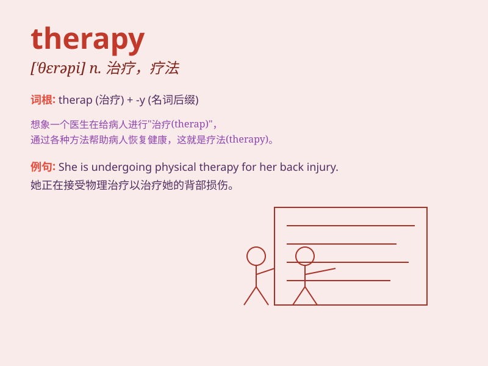

## therapy

**英音:** _[\'θerəpɪ]_ **美音:** _[\'θɛrəpi]_

**译义:** *n.治疗*

### 短语

+ **physical therapy:** _物理疗法_

+ **occupational therapy:** _职业疗法_

+ **psychotherapy:** _心理治疗；精神治疗_

+ **radiation therapy:** _放射治疗_

+ **gene therapy:** _基因治疗_

### 例句

#### 例句1

> **She is undergoing physical therapy to recover from her
injury.**

**中文翻译:** 她正在接受物理治疗以从受伤中恢复。

**单词释义:** 治疗；疗法

#### 例句2

> **Music therapy can have a calming effect on patients with
anxiety.**

**中文翻译:** 音乐疗法对焦虑症患者能起到镇静的作用。

**单词释义:** 治疗；疗法

#### 例句3

> **The doctor recommended a course of therapy to improve his mental
health.**

**中文翻译:** 医生建议进行一个疗程的治疗来改善他的心理健康。

**单词释义:** 治疗；疗法

### 背诵小故事

> A patient was in great pain. But with the right therapy, which
included special exercises and nice talks, the patient gradually
recovered and smiled again.

**一位病人处于巨大的痛苦中。但通过正确的治疗，包括特殊的锻炼和友好的交谈，病人逐渐康复并再次露出了笑容。**

### 图义

