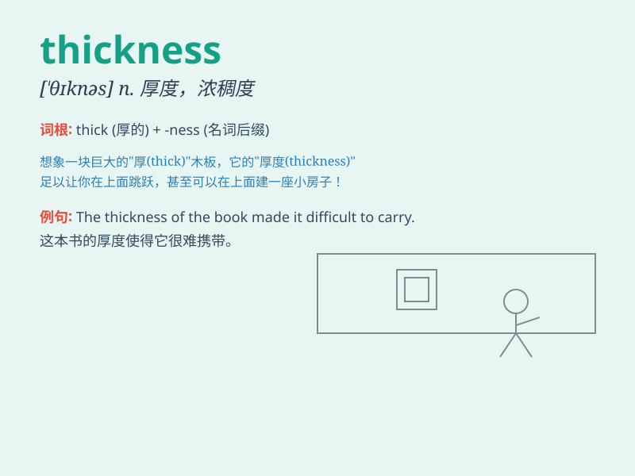

## thickness

**英音:** _[\'θɪknɪs]_ **美音:** _[ˈθɪknɪs]_

**译义:** *n.厚度,浓度,稠密,(一)层,混浊*

### 短语

+ **thickness gauge:** _厚度计；测厚仪_

+ **sheet thickness:** _薄板厚度；片材厚度_

+ **wall thickness:** _壁厚；墙厚_

+ **thickness variation:** _厚度变化；厚度变异_

+ **average thickness:** _平均厚度_

### 例句

#### 例句1

> **The thickness of the ice on the lake varies from place to
place.**

**中文翻译:** 湖面上冰的厚度各处不同。

**单词释义:** 厚度

#### 例句2

> **The book has a considerable thickness.**

**中文翻译:** 这本书相当厚。

**单词释义:** 厚度

#### 例句3

> **We need to measure the thickness of the steel plate.**

**中文翻译:** 我们需要测量这块钢板的厚度。

**单词释义:** 厚度

### 背诵小故事

> A little ant was trying to cross a thick piece of wood. It struggled
because of the wood\'s thickness. Finally, with great effort, it made
it. The thick wood taught the ant a lesson about thickness.

**一只小蚂蚁试图穿过一块厚厚的木头。它挣扎着，因为木头的厚度。最后，费了很大的劲，它成功了。这块厚木头让蚂蚁明白了厚度的概念。**

### 图义

