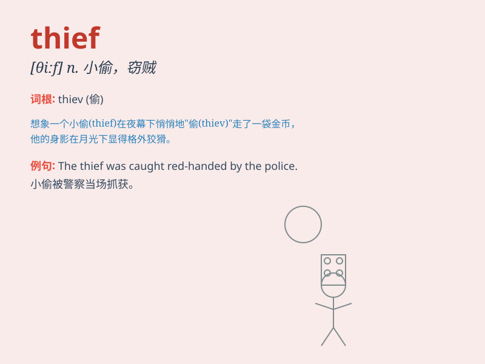

## thief

**英音:** _[θiːf]_ **美音:** _[θif]_

**译义:** *n.小偷,贼*

### 短语

+ **petty thief:** _小偷，扒手_

+ **habitual thief:** _惯偷_

+ **professional thief:** _职业小偷_

+ **thief in the night:** _夜间的贼；不知不觉降临的灾难_

+ **catch a thief:** _抓住小偷_

### 例句

#### 例句1

> **The thief was caught by the police last night.**

**中文翻译:** 昨晚那个小偷被警察抓住了。

**单词释义:** 小偷

#### 例句2

> **We need to be careful of thieves when we are in a crowded
place.**

**中文翻译:** 当我们在拥挤的地方时，要小心小偷。

**单词释义:** 小偷

#### 例句3

> **The thief stole my wallet and ran away quickly.**

**中文翻译:** 那个小偷偷了我的钱包然后迅速跑掉了。

**单词释义:** 小偷

### 背诵小故事

> One night, a thief sneaked into a house. He was very quiet but the
owner\'s dog barked loudly. The thief was scared and ran away. Remember,
thief means someone who steals things illegally.

**一天晚上，一个小偷潜入一所房子。他非常安静，但主人的狗大声叫了起来。小偷被吓到然后跑掉了。记住，thief
意思是非法偷东西的人。**

### 图义

