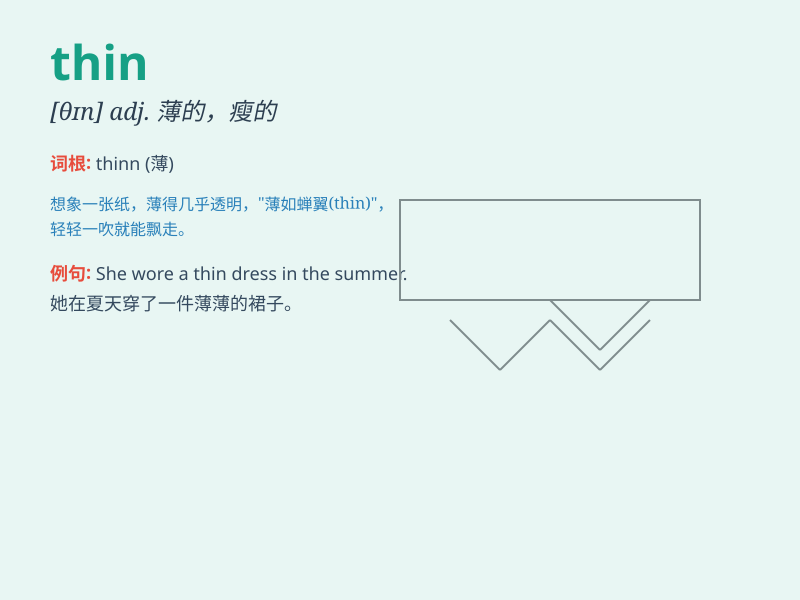

## thin

**英音:** _[θɪn]_ **美音:** _[θɪn]_

**译义:**
*adj.薄的,细的,瘦的,稀少的,稀疏的,(液体、气体)稀薄的,淡的,空洞的vt.使变薄,使变细,使稀少,使淡vi.变薄,变细,稀少,变淡adv.薄地,稀疏地,微弱地n.细小部分*

### 短语

+ **thin air:** _凭空；无影无踪_

+ **thin out:** _（使）变稀疏；（使）变薄_

+ **thin slice:** _薄片_

+ **thin layer:** _薄层_

+ **wear thin:** _逐渐消失；变得不受欢迎；变得乏味_

### 例句

#### 例句1

> **She is very thin.**

**中文翻译:** 她非常瘦。

**单词释义:** 瘦的

#### 例句2

> **The ice on the lake is too thin to skate on.**

**中文翻译:** 湖上的冰太薄，不能在上面滑冰。

**单词释义:** 薄的

#### 例句3

> **The crowd was thin at the early morning market.**

**中文翻译:** 清晨的市场上人群稀少。

**单词释义:** 稀少的

### 背诵小故事

> A little monkey wanted to pass through a narrow gap. But it was too
fat. So it ate less and exercised more. Finally, it became thin and
passed through easily.

**一只小猴子想穿过一个狭窄的缝隙。但它太胖了。于是它少吃多运动。最后，它变瘦了，轻松地穿过去了。**

### 图义

