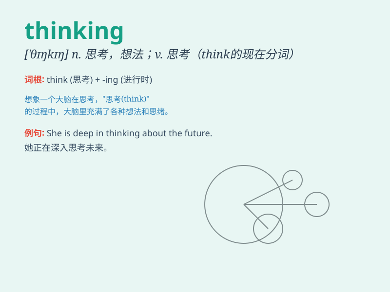

## thinking

**英音:** _[θɪŋkɪŋ]_ **美音:** _[\'θɪŋkɪŋ]_

**译义:** *n.思想*

### 短语

+ **creative thinking:** _创造性思维_

+ **logical thinking:** _逻辑思维_

+ **critical thinking:** _批判性思维_

+ **quick thinking:** _思维敏捷_

+ **systematic thinking:** _系统思维_

### 例句

#### 例句1

> **I\'m lost in my own thinking.**

**中文翻译:** 我陷入了自己的思考之中。

**单词释义:** 思考；想法

#### 例句2

> **His thinking on this matter is quite profound.**

**中文翻译:** 他在这件事上的想法相当深刻。

**单词释义:** 想法；见解

#### 例句3

> **She has a creative thinking that always surprises us.**

**中文翻译:** 她有一种创造性的思维，总是让我们感到惊讶。

**单词释义:** 思维

### 背诵小故事

> One day, a little monkey was sitting under a tree, looking at the sky
and deep in thinking. It was trying to figure out how to get the bananas
on the tall branch. Its thinking face was so cute.

**一天，一只小猴子坐在树下，望着天空陷入沉思。它正在努力想办法如何拿到高高的树枝上的香蕉。它思考的样子太可爱了。**

### 图义

