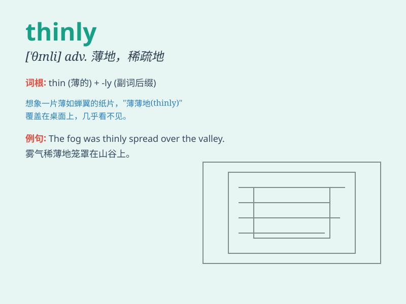

## thinly

**英音:** _[ˈθɪnli]_ **美音:** _[ˈθɪnli]_

**译义:** *adv.稀疏地*

### 短语

+ **thinly populated:** _人口稀少的_

+ **thinly sliced:** _切成薄片的_

+ **thinly veiled:** _几乎不加掩饰的；露骨的_

+ **spread thinly:** _分布稀疏；摊薄_

+ **thinly disguised:** _伪装得很拙劣_

### 例句

#### 例句1

> **The bread was thinly sliced.**

**中文翻译:** 面包被切得很薄。

**单词释义:** 薄地；稀疏地

#### 例句2

> **She smiled thinly.**

**中文翻译:** 她淡淡地笑了笑。

**单词释义:** 淡淡地；微弱地

#### 例句3

> **The paint was applied thinly.**

**中文翻译:** 油漆涂得很薄。

**单词释义:** 薄地；少量地

### 背诵小故事

> A thin girl was walking thinly on a narrow path. She was so weak that
she moved slowly. But she still insisted and hoped to reach the
destination soon.

**一个瘦弱的女孩在一条狭窄的小路上小心翼翼地走着。她是如此虚弱，走得很慢。但她仍然坚持着，希望能尽快到达目的地。**

### 图义

