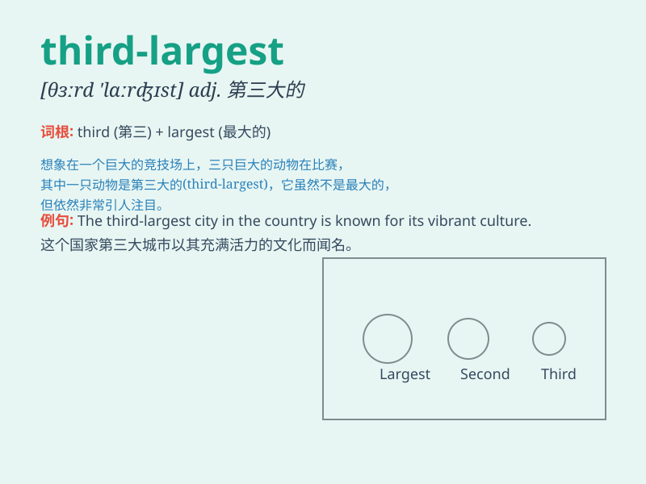

## third-largest

**英音:** __ **美音:** __

**译义:** *第三大的*

### 短语

+ **third-largest city:** _第三大城市_

+ **third-largest economy:** _第三大经济体_

+ **third-largest population:** _第三大人口_

+ **third-largest company:** _第三大公司_

+ **third-largest market:** _第三大市场_

### 例句

#### 例句1

> **China is the third-largest economy in the world.**

**中文翻译:** 中国是世界上第三大经济体。

**单词释义:** 第三大的

#### 例句2

> **The company is the third-largest producer of electronic goods in
the country.**

**中文翻译:** 这家公司是该国电子产品的第三大生产商。

**单词释义:** 第三大的

#### 例句3

> **This city has the third-largest population among all the cities
in the province.**

**中文翻译:** 这座城市在该省所有城市中人口数量位居第三。

**单词释义:** 第三大的

### 背诵小故事

> Imagine a race. There are many participants. When the race ends, we
find that one person comes in the third-largest position. It means they
are not the biggest or the second biggest but the third in terms of size
or importance.

**想象一场比赛。有许多参与者。当比赛结束时，我们发现有一个人处于第三大的位置。这意味着就规模或重要性而言，他们不是最大的，也不是第二大的，而是第三大的。**

### 图义

