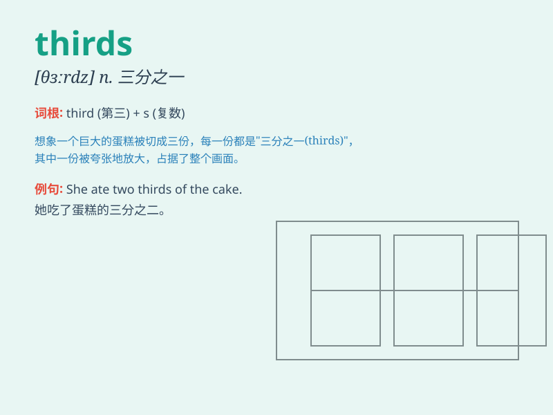

## thirds

**英音:** _[θɜːrdz]_ **美音:** _[θɜːrdz]_

**译义:** *n. 三分之一（third 的复数形式）；三分音符（thirds
的复数形式）*

### 短语

+ **two thirds:** _三分之二_

+ **three thirds:** _三分之三_

+ **one thirds:** _三分之一_

+ **four thirds:** _三分之四_

+ **five thirds:** _三分之五_

### 例句

#### 例句1

> **Two-thirds of the students passed the exam.**

**中文翻译:** 三分之二的学生通过了考试。

**单词释义:** 三分之二

#### 例句2

> **One-thirds of the cake was eaten.**

**中文翻译:** 这块蛋糕的三分之一被吃了。

**单词释义:** 三分之一

#### 例句3

> **Three-thirds is equal to one.**

**中文翻译:** 三分之三等于一。

**单词释义:** 三分之三

### 背诵小故事

> One day, Tom was dividing apples into equal parts. He cut them into
thirds. But his friends still argued about the fairness. Finally, Tom
found a better way to share and everyone was happy.

**一天，汤姆在把苹果等分。他把它们切成了三等份。但他的朋友们仍在争论分配是否公平。最后，汤姆找到了更好的分享方式，大家都开心了。**

### 图义

