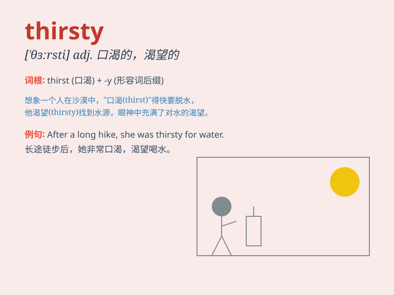

## thirsty

**英音:** _[\'θɜːstɪ]_ **美音:** _[\'θɝsti]_

**译义:** *adj.口渴的,渴望的,热望的*

### 短语

+ **be thirsty for:** _渴望；渴求_

+ **thirsty work:** _费力的工作_

+ **thirsty soil:** _干旱的土壤_

+ **feel thirsty:** _感到口渴_

+ **thirsty plants:** _缺水的植物_

### 例句

#### 例句1

> **I\'m thirsty after running for an hour.**

**中文翻译:** 我跑了一个小时后感到口渴。

**单词释义:** 口渴的

#### 例句2

> **The plants in the garden are thirsty. We need to water them.**

**中文翻译:** 花园里的植物缺水了。我们需要给它们浇水。

**单词释义:** 缺水的

#### 例句3

> **He has a thirsty mind and always wants to learn new things.**

**中文翻译:** 他有强烈的求知欲，总是想学习新事物。

**单词释义:** 渴望的；渴求的

### 背诵小故事

> One hot summer day, Tom was playing outside. After a long time, he
felt very thirsty. He rushed home and drank a big glass of water. Then
he said, \'I was so thirsty!\'

**在一个炎热的夏日，汤姆在外面玩耍。很长时间后，他感到非常口渴。他冲回家，喝了一大杯水。然后他说：'我太渴了！'**

### 图义

